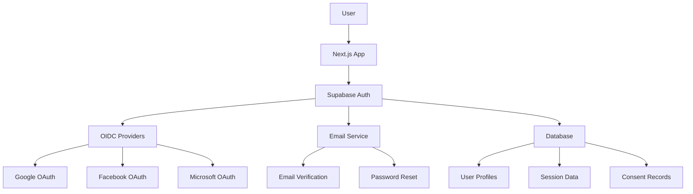
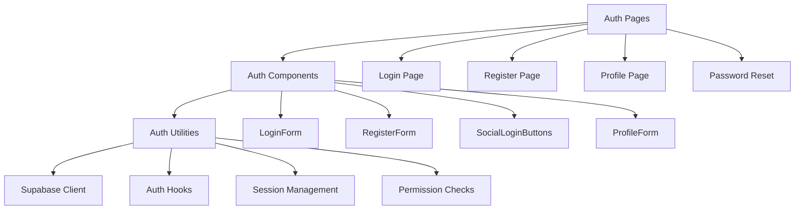
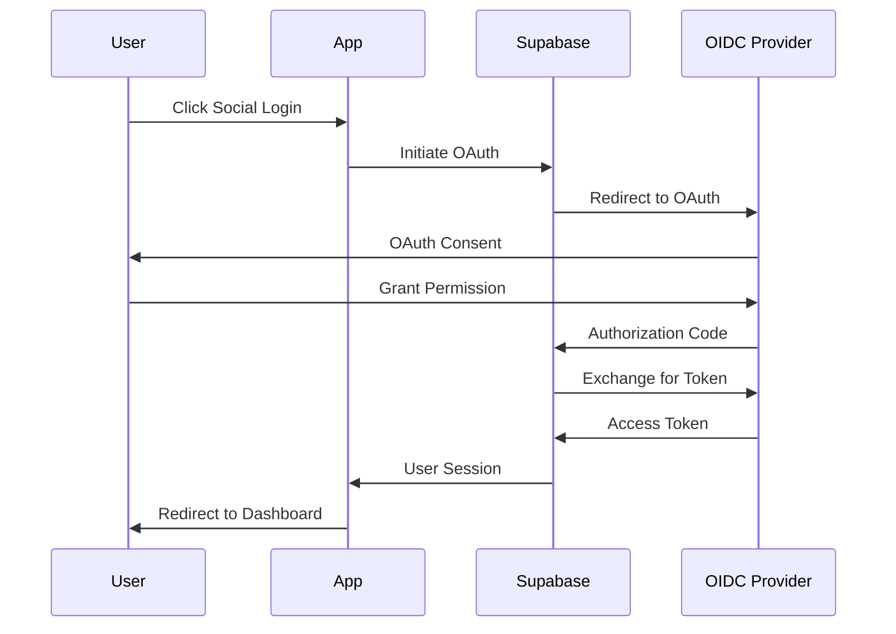
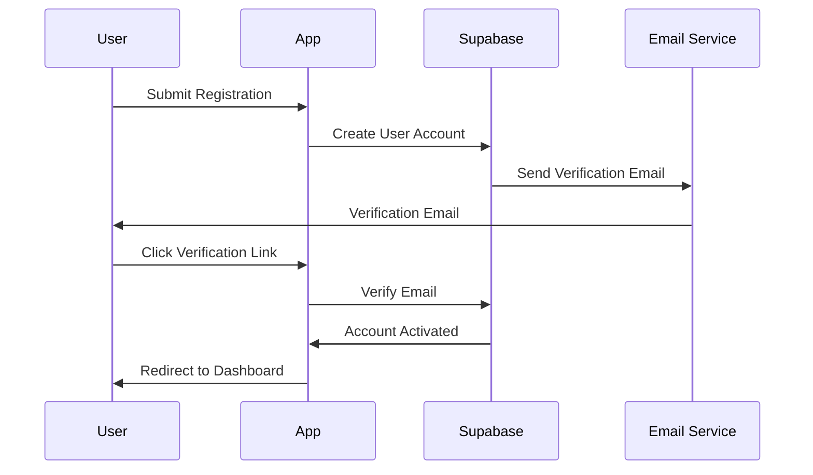
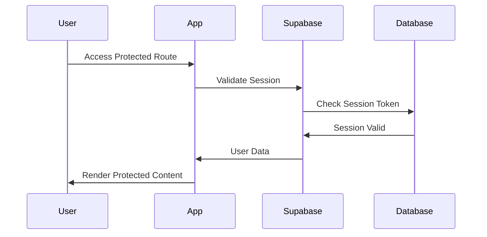

# Authentication System Design

## Overview
The authentication system provides secure user registration and login capabilities for the Udaman competition platform, supporting both OIDC social login and traditional email registration with comprehensive session management and account controls.

## Architecture

### High-Level Architecture


### Component Architecture


## Data Models

### User Profile
```typescript
interface UserProfile {
  id: string;
  email: string;
  display_name?: string;
  avatar_url?: string;
  created_at: Date;
  updated_at: Date;
  email_verified: boolean;
  subscription_tier: 'free' | 'premium';
  consent_given: boolean;
  consent_date?: Date;
  last_login: Date;
  login_count: number;
}
```

### Session Data
```typescript
interface SessionData {
  user_id: string;
  session_token: string;
  expires_at: Date;
  created_at: Date;
  ip_address: string;
  user_agent: string;
  is_active: boolean;
}
```

### Consent Record
```typescript
interface ConsentRecord {
  user_id: string;
  consent_type: 'data_processing' | 'marketing' | 'cookies';
  granted: boolean;
  granted_at: Date;
  revoked_at?: Date;
  ip_address: string;
  user_agent: string;
}
```

## Database Schema

### Users Table
```sql
CREATE TABLE users (
  id UUID PRIMARY KEY DEFAULT gen_random_uuid(),
  email VARCHAR(255) UNIQUE NOT NULL,
  display_name VARCHAR(100),
  avatar_url TEXT,
  created_at TIMESTAMP WITH TIME ZONE DEFAULT NOW(),
  updated_at TIMESTAMP WITH TIME ZONE DEFAULT NOW(),
  email_verified BOOLEAN DEFAULT FALSE,
  subscription_tier VARCHAR(20) DEFAULT 'free',
  consent_given BOOLEAN DEFAULT FALSE,
  consent_date TIMESTAMP WITH TIME ZONE,
  last_login TIMESTAMP WITH TIME ZONE,
  login_count INTEGER DEFAULT 0
);

CREATE INDEX idx_users_email ON users(email);
CREATE INDEX idx_users_subscription_tier ON users(subscription_tier);
```

### Sessions Table
```sql
CREATE TABLE sessions (
  id UUID PRIMARY KEY DEFAULT gen_random_uuid(),
  user_id UUID REFERENCES users(id) ON DELETE CASCADE,
  session_token VARCHAR(255) UNIQUE NOT NULL,
  expires_at TIMESTAMP WITH TIME ZONE NOT NULL,
  created_at TIMESTAMP WITH TIME ZONE DEFAULT NOW(),
  ip_address INET,
  user_agent TEXT,
  is_active BOOLEAN DEFAULT TRUE
);

CREATE INDEX idx_sessions_user_id ON sessions(user_id);
CREATE INDEX idx_sessions_token ON sessions(session_token);
CREATE INDEX idx_sessions_expires ON sessions(expires_at);
```

### Consent Records Table
```sql
CREATE TABLE consent_records (
  id UUID PRIMARY KEY DEFAULT gen_random_uuid(),
  user_id UUID REFERENCES users(id) ON DELETE CASCADE,
  consent_type VARCHAR(50) NOT NULL,
  granted BOOLEAN NOT NULL,
  granted_at TIMESTAMP WITH TIME ZONE DEFAULT NOW(),
  revoked_at TIMESTAMP WITH TIME ZONE,
  ip_address INET,
  user_agent TEXT
);

CREATE INDEX idx_consent_user_id ON consent_records(user_id);
CREATE INDEX idx_consent_type ON consent_records(consent_type);
```

## Component Design

### Authentication Pages

#### Login Page (`/auth/login`)
- **Purpose**: Primary entry point for user authentication
- **Components**: LoginForm, SocialLoginButtons, PasswordResetLink
- **Features**: Email/password login, OIDC social login, remember me option
- **Validation**: Real-time email format validation, password strength check

#### Register Page (`/auth/register`)
- **Purpose**: New user registration with email verification
- **Components**: RegisterForm, TermsAndConditions, ConsentCheckbox
- **Features**: Email validation, password strength requirements, consent collection
- **Validation**: Email uniqueness, password complexity, terms acceptance

#### Profile Page (`/auth/profile`)
- **Purpose**: User profile management and account settings
- **Components**: ProfileForm, SubscriptionStatus, PrivacySettings
- **Features**: Profile editing, subscription management, privacy controls
- **Validation**: Email format, display name length, avatar size

### Authentication Components

#### LoginForm Component
```typescript
interface LoginFormProps {
  onSuccess: (user: UserProfile) => void;
  onError: (error: AuthError) => void;
  redirectTo?: string;
}

interface LoginFormState {
  email: string;
  password: string;
  rememberMe: boolean;
  isLoading: boolean;
  errors: Record<string, string>;
}
```

#### SocialLoginButtons Component
```typescript
interface SocialLoginButtonsProps {
  providers: OIDCProvider[];
  onSuccess: (user: UserProfile) => void;
  onError: (error: AuthError) => void;
}

type OIDCProvider = 'google' | 'facebook' | 'microsoft';
```

#### AuthGuard Component
```typescript
interface AuthGuardProps {
  children: React.ReactNode;
  requireAuth?: boolean;
  requireVerified?: boolean;
  requirePremium?: boolean;
  fallback?: React.ReactNode;
}
```

## Authentication Flow

### OIDC Social Login Flow


### Email Registration Flow


### Session Management Flow


## Security Implementation

### Password Security
- **Hashing**: bcrypt with salt rounds of 12
- **Validation**: Minimum 8 characters, complexity requirements
- **Rate Limiting**: 5 attempts per 15 minutes
- **Breach Detection**: Check against known breached passwords

### Session Security
- **Token Generation**: Cryptographically secure random tokens
- **Expiration**: 30 days for remember me, 24 hours for regular sessions
- **Rotation**: New token on password change
- **Revocation**: Immediate on logout or security event

### OIDC Security
- **State Parameter**: CSRF protection for OAuth flows
- **PKCE**: Proof Key for Code Exchange for public clients
- **Token Validation**: Verify issuer, audience, and signature
- **Scope Limitation**: Request only necessary permissions

### Data Protection
- **Encryption**: All sensitive data encrypted at rest
- **Transmission**: HTTPS only for all authentication traffic
- **Logging**: Audit trail for all authentication events
- **GDPR Compliance**: Consent tracking and data portability

## Error Handling

### Authentication Errors
```typescript
enum AuthErrorType {
  INVALID_CREDENTIALS = 'invalid_credentials',
  EMAIL_NOT_VERIFIED = 'email_not_verified',
  ACCOUNT_LOCKED = 'account_locked',
  RATE_LIMITED = 'rate_limited',
  NETWORK_ERROR = 'network_error',
  OAUTH_ERROR = 'oauth_error',
  CONSENT_REQUIRED = 'consent_required'
}

interface AuthError {
  type: AuthErrorType;
  message: string;
  code?: string;
  retryAfter?: number;
}
```

### Error Recovery Strategies
- **Invalid Credentials**: Clear password field, show helpful message
- **Email Not Verified**: Resend verification email option
- **Account Locked**: Temporary lock with countdown timer
- **Rate Limited**: Show retry timer, suggest alternative login
- **Network Error**: Retry button with exponential backoff
- **OAuth Error**: Fallback to email registration

## Performance Considerations

### Optimization Strategies
- **Lazy Loading**: Load OAuth providers on demand
- **Caching**: Cache user profile data in memory
- **Preloading**: Preload common authentication pages
- **Bundle Splitting**: Separate auth code from main bundle

### Performance Metrics
- **Login Time**: < 2 seconds for email, < 3 seconds for OAuth
- **Registration Time**: < 5 seconds including email verification
- **Session Validation**: < 100ms for cached sessions
- **Error Recovery**: < 1 second for retry attempts

## Testing Strategy

### Unit Tests
- **Component Tests**: Test all auth components in isolation
- **Hook Tests**: Test custom auth hooks
- **Utility Tests**: Test auth utility functions
- **Validation Tests**: Test form validation logic

### Integration Tests
- **Flow Tests**: Test complete authentication flows
- **API Tests**: Test Supabase auth integration
- **Error Tests**: Test error handling scenarios
- **Session Tests**: Test session management

### E2E Tests
- **Login Flow**: Complete login process
- **Registration Flow**: Complete registration process
- **OAuth Flow**: Complete OAuth authentication
- **Profile Management**: Profile update and settings

## Deployment Considerations

### Environment Configuration
```typescript
interface AuthConfig {
  supabaseUrl: string;
  supabaseAnonKey: string;
  oauthProviders: {
    google: { clientId: string; clientSecret: string };
    facebook: { clientId: string; clientSecret: string };
    microsoft: { clientId: string; clientSecret: string };
  };
  emailService: {
    provider: 'resend' | 'sendgrid' | 'mailgun';
    apiKey: string;
    fromEmail: string;
  };
  security: {
    sessionTimeout: number;
    maxLoginAttempts: number;
    lockoutDuration: number;
  };
}
```

### Security Headers
```typescript
const securityHeaders = {
  'Strict-Transport-Security': 'max-age=31536000; includeSubDomains',
  'X-Frame-Options': 'DENY',
  'X-Content-Type-Options': 'nosniff',
  'Referrer-Policy': 'strict-origin-when-cross-origin',
  'Content-Security-Policy': "default-src 'self'; script-src 'self' 'unsafe-inline' https://accounts.google.com https://www.facebook.com https://login.microsoftonline.com;"
};
```

## Monitoring and Analytics

### Authentication Metrics
- **Login Success Rate**: Track successful vs failed logins
- **Registration Conversion**: Track signup completion rate
- **OAuth Usage**: Track which providers are most popular
- **Session Duration**: Track average session length
- **Error Rates**: Track authentication error frequency

### Security Monitoring
- **Failed Login Attempts**: Monitor for brute force attacks
- **Suspicious Activity**: Track unusual login patterns
- **Account Lockouts**: Monitor account security events
- **OAuth Errors**: Track OAuth provider issues

## Success Criteria
- Users can successfully authenticate via email and OIDC
- Session management provides secure, persistent login
- Error handling provides clear, actionable feedback
- Performance meets all specified requirements
- Security measures protect against common attacks
- GDPR compliance is maintained throughout
- All authentication flows work across devices and browsers
