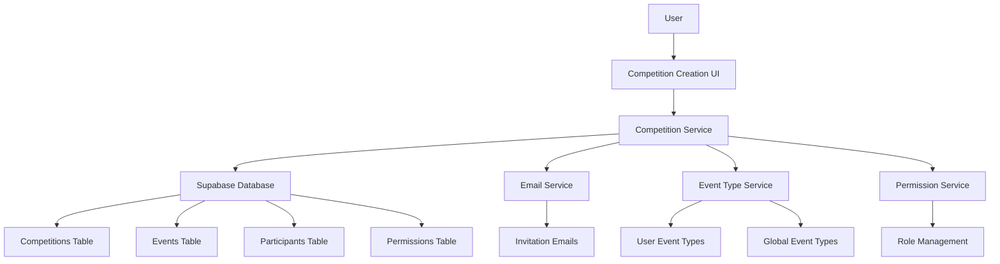
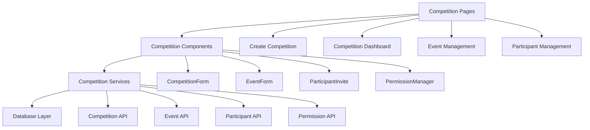
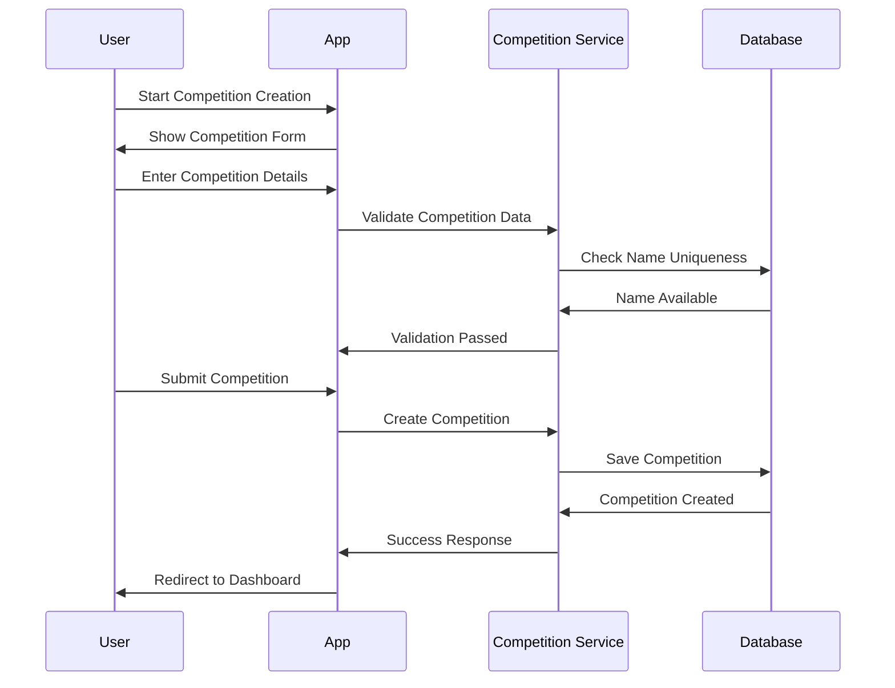
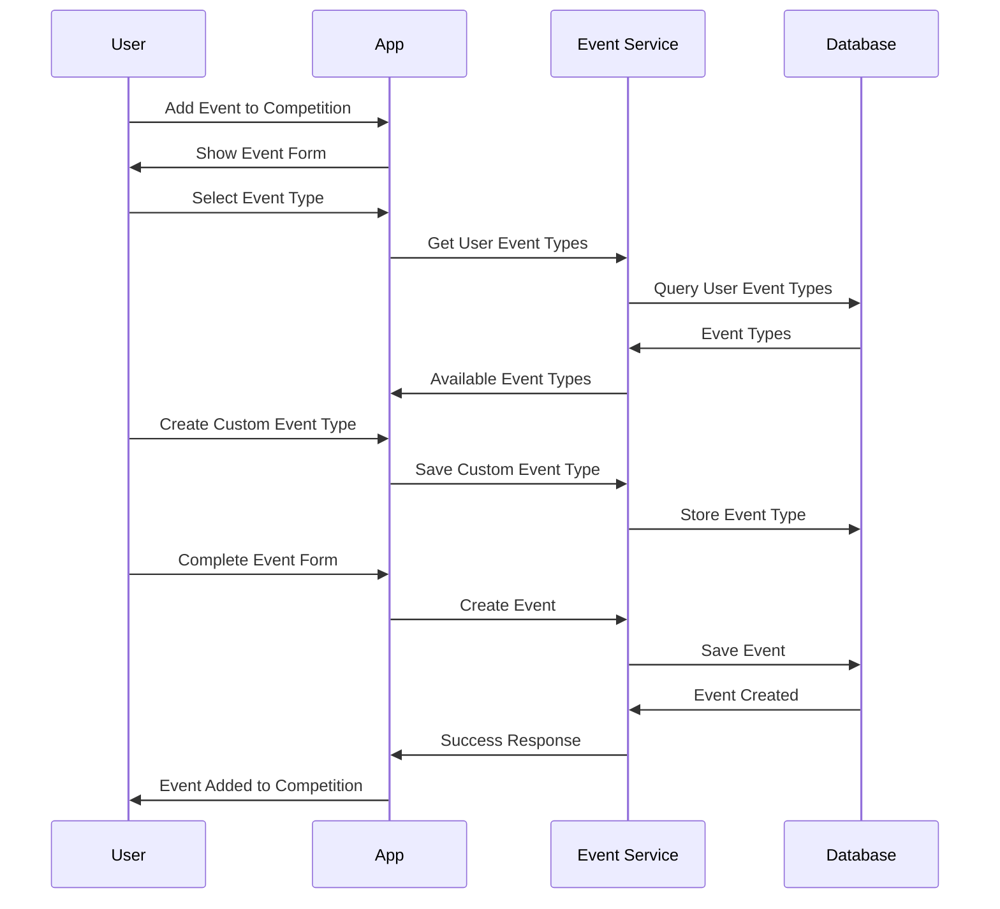
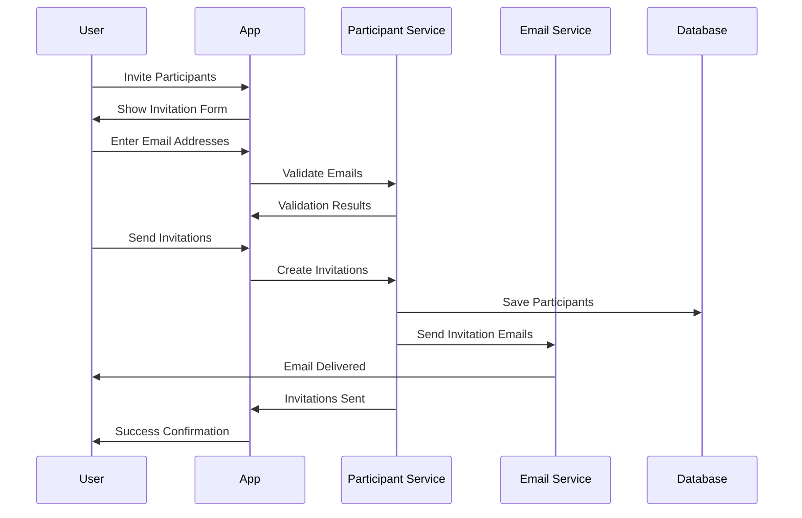

# Competition Creation System Design

## Overview
The competition creation system enables authenticated users to create and configure multi-event competitions with detailed rules, scoring systems, and participant management capabilities. The system supports creator-specific naming, smart event type dropdowns, and comprehensive permission management.

## Architecture

### High-Level Architecture


### Component Architecture


## Data Models

### Competition
```typescript
interface Competition {
  id: string;
  creator_id: string;
  name: string;
  description: string;
  start_date: Date;
  end_date: Date;
  status: 'draft' | 'active' | 'completed' | 'cancelled';
  created_at: Date;
  updated_at: Date;
  settings: CompetitionSettings;
  metadata: CompetitionMetadata;
}

interface CompetitionSettings {
  allow_spectators: boolean;
  public_leaderboard: boolean;
  auto_start_events: boolean;
  tie_breaking_rules: string;
  scoring_system: 'position_based' | 'custom';
}

interface CompetitionMetadata {
  total_participants: number;
  total_events: number;
  current_round: number;
  last_activity: Date;
}
```

### Event
```typescript
interface Event {
  id: string;
  competition_id: string;
  name: string;
  description: string;
  event_type: string;
  location: EventLocation;
  scheduled_date: Date;
  duration_minutes: number;
  max_participants: number;
  rules: string;
  requirements: string;
  scoring_config: ScoringConfig;
  status: 'scheduled' | 'in_progress' | 'completed' | 'cancelled';
  created_at: Date;
  updated_at: Date;
}

interface EventLocation {
  address: string;
  city: string;
  state: string;
  zip_code: string;
  country: string;
  coordinates?: { lat: number; lng: number };
}

interface ScoringConfig {
  type: 'position_based' | 'points_based' | 'time_based';
  rules: Record<string, any>;
  tie_breaker: string;
}
```

### Participant
```typescript
interface Participant {
  id: string;
  competition_id: string;
  user_id: string;
  role: 'creator' | 'admin' | 'participant' | 'spectator';
  status: 'invited' | 'accepted' | 'declined' | 'pending';
  invited_at: Date;
  accepted_at?: Date;
  declined_at?: Date;
  permissions: ParticipantPermissions;
}

interface ParticipantPermissions {
  can_edit_competition: boolean;
  can_manage_events: boolean;
  can_manage_participants: boolean;
  can_enter_scores: boolean;
  can_view_leaderboard: boolean;
  can_send_messages: boolean;
}
```

### User Event Type
```typescript
interface UserEventType {
  id: string;
  user_id: string;
  name: string;
  description?: string;
  category: string;
  created_at: Date;
  usage_count: number;
}
```

## Database Schema

### Competitions Table
```sql
CREATE TABLE competitions (
  id UUID PRIMARY KEY DEFAULT gen_random_uuid(),
  creator_id UUID REFERENCES users(id) ON DELETE CASCADE,
  name VARCHAR(255) NOT NULL,
  description TEXT,
  start_date TIMESTAMP WITH TIME ZONE NOT NULL,
  end_date TIMESTAMP WITH TIME ZONE NOT NULL,
  status VARCHAR(20) DEFAULT 'draft',
  created_at TIMESTAMP WITH TIME ZONE DEFAULT NOW(),
  updated_at TIMESTAMP WITH TIME ZONE DEFAULT NOW(),
  settings JSONB DEFAULT '{}',
  metadata JSONB DEFAULT '{}'
);

CREATE INDEX idx_competitions_creator_id ON competitions(creator_id);
CREATE INDEX idx_competitions_status ON competitions(status);
CREATE INDEX idx_competitions_dates ON competitions(start_date, end_date);
CREATE UNIQUE INDEX idx_competitions_creator_name ON competitions(creator_id, name);
```

### Events Table
```sql
CREATE TABLE events (
  id UUID PRIMARY KEY DEFAULT gen_random_uuid(),
  competition_id UUID REFERENCES competitions(id) ON DELETE CASCADE,
  name VARCHAR(255) NOT NULL,
  description TEXT,
  event_type VARCHAR(100) NOT NULL,
  location JSONB NOT NULL,
  scheduled_date TIMESTAMP WITH TIME ZONE NOT NULL,
  duration_minutes INTEGER DEFAULT 60,
  max_participants INTEGER,
  rules TEXT,
  requirements TEXT,
  scoring_config JSONB DEFAULT '{}',
  status VARCHAR(20) DEFAULT 'scheduled',
  created_at TIMESTAMP WITH TIME ZONE DEFAULT NOW(),
  updated_at TIMESTAMP WITH TIME ZONE DEFAULT NOW()
);

CREATE INDEX idx_events_competition_id ON events(competition_id);
CREATE INDEX idx_events_type ON events(event_type);
CREATE INDEX idx_events_scheduled_date ON events(scheduled_date);
CREATE INDEX idx_events_status ON events(status);
```

### Participants Table
```sql
CREATE TABLE participants (
  id UUID PRIMARY KEY DEFAULT gen_random_uuid(),
  competition_id UUID REFERENCES competitions(id) ON DELETE CASCADE,
  user_id UUID REFERENCES users(id) ON DELETE CASCADE,
  role VARCHAR(20) DEFAULT 'participant',
  status VARCHAR(20) DEFAULT 'invited',
  invited_at TIMESTAMP WITH TIME ZONE DEFAULT NOW(),
  accepted_at TIMESTAMP WITH TIME ZONE,
  declined_at TIMESTAMP WITH TIME ZONE,
  permissions JSONB DEFAULT '{}',
  UNIQUE(competition_id, user_id)
);

CREATE INDEX idx_participants_competition_id ON participants(competition_id);
CREATE INDEX idx_participants_user_id ON participants(user_id);
CREATE INDEX idx_participants_status ON participants(status);
CREATE INDEX idx_participants_role ON participants(role);
```

### User Event Types Table
```sql
CREATE TABLE user_event_types (
  id UUID PRIMARY KEY DEFAULT gen_random_uuid(),
  user_id UUID REFERENCES users(id) ON DELETE CASCADE,
  name VARCHAR(100) NOT NULL,
  description TEXT,
  category VARCHAR(50) DEFAULT 'custom',
  created_at TIMESTAMP WITH TIME ZONE DEFAULT NOW(),
  usage_count INTEGER DEFAULT 0
);

CREATE INDEX idx_user_event_types_user_id ON user_event_types(user_id);
CREATE INDEX idx_user_event_types_category ON user_event_types(category);
CREATE UNIQUE INDEX idx_user_event_types_user_name ON user_event_types(user_id, name);
```

## Component Design

### Competition Creation Pages

#### Create Competition Page (`/competitions/create`)
- **Purpose**: Primary interface for creating new competitions
- **Components**: CompetitionForm, EventTypeSelector, DateRangePicker
- **Features**: Step-by-step creation wizard, real-time validation, preview
- **Validation**: Name uniqueness per creator, date range validation, required fields

#### Competition Dashboard (`/competitions/[id]`)
- **Purpose**: Central management interface for competition creators and admins
- **Components**: CompetitionOverview, EventList, ParticipantList, QuickActions
- **Features**: Real-time updates, quick event creation, participant management
- **Permissions**: Role-based access control for different dashboard sections

#### Event Management Page (`/competitions/[id]/events`)
- **Purpose**: Detailed event configuration and management
- **Components**: EventForm, EventList, EventScheduler, LocationPicker
- **Features**: Drag-and-drop event ordering, location autocomplete, scheduling
- **Validation**: Event type validation, location validation, scheduling conflicts

### Competition Components

#### CompetitionForm Component
```typescript
interface CompetitionFormProps {
  competition?: Competition;
  onSave: (competition: CompetitionFormData) => Promise<void>;
  onCancel: () => void;
}

interface CompetitionFormData {
  name: string;
  description: string;
  start_date: Date;
  end_date: Date;
  settings: CompetitionSettings;
}

interface CompetitionFormState {
  formData: CompetitionFormData;
  errors: Record<string, string>;
  isSubmitting: boolean;
  isValid: boolean;
}
```

#### EventTypeSelector Component
```typescript
interface EventTypeSelectorProps {
  value: string;
  onChange: (eventType: string) => void;
  onCreateNew: (name: string) => Promise<void>;
  userEventTypes: UserEventType[];
  globalEventTypes: string[];
}

interface EventTypeSelectorState {
  searchTerm: string;
  showCreateForm: boolean;
  newEventType: string;
  isCreating: boolean;
}
```

#### ParticipantInvite Component
```typescript
interface ParticipantInviteProps {
  competitionId: string;
  onInviteSent: (participant: Participant) => void;
  onError: (error: string) => void;
}

interface ParticipantInviteState {
  emailAddresses: string[];
  role: ParticipantRole;
  customMessage: string;
  isSending: boolean;
  errors: Record<string, string>;
}
```

## Competition Creation Flow

### Basic Competition Setup Flow


### Event Creation Flow


### Participant Invitation Flow


## Smart Event Type System

### Event Type Categories
```typescript
const EVENT_CATEGORIES = {
  SPORTS: ['Golf', 'Tennis', 'Basketball', 'Soccer', 'Baseball'],
  OUTDOOR: ['Fishing', 'Hiking', 'Camping', 'Archery', 'Axe Throwing'],
  INDOOR: ['Chess', 'Ping Pong', 'Foosball', 'Mario Kart', 'Board Games'],
  CREATIVE: ['Poetry Writing', 'Art Contest', 'Cooking Challenge', 'Photography'],
  PHYSICAL: ['Bench Press', 'Running', 'Swimming', 'Cycling', 'Yoga'],
  TECHNICAL: ['Model Rocketry', 'Pine Wood Derby', 'Coding Challenge', 'Engineering']
} as const;
```

### User Event Type Management
```typescript
interface EventTypeManager {
  // Get user's personal event types
  getUserEventTypes(userId: string): Promise<UserEventType[]>;
  
  // Create new custom event type
  createUserEventType(userId: string, name: string, category?: string): Promise<UserEventType>;
  
  // Update event type usage count
  incrementUsageCount(eventTypeId: string): Promise<void>;
  
  // Get suggested event types based on user history
  getSuggestedEventTypes(userId: string): Promise<string[]>;
}
```

## Permission Management

### Role-Based Access Control
```typescript
enum ParticipantRole {
  CREATOR = 'creator',
  ADMIN = 'admin',
  PARTICIPANT = 'participant',
  SPECTATOR = 'spectator'
}

interface PermissionMatrix {
  [ParticipantRole.CREATOR]: {
    can_edit_competition: true;
    can_manage_events: true;
    can_manage_participants: true;
    can_enter_scores: true;
    can_view_leaderboard: true;
    can_send_messages: true;
    can_delete_competition: true;
  };
  [ParticipantRole.ADMIN]: {
    can_edit_competition: false;
    can_manage_events: true;
    can_manage_participants: true;
    can_enter_scores: true;
    can_view_leaderboard: true;
    can_send_messages: true;
    can_delete_competition: false;
  };
  [ParticipantRole.PARTICIPANT]: {
    can_edit_competition: false;
    can_manage_events: false;
    can_manage_participants: false;
    can_enter_scores: false;
    can_view_leaderboard: true;
    can_send_messages: true;
    can_delete_competition: false;
  };
  [ParticipantRole.SPECTATOR]: {
    can_edit_competition: false;
    can_manage_events: false;
    can_manage_participants: false;
    can_enter_scores: false;
    can_view_leaderboard: true;
    can_send_messages: false;
    can_delete_competition: false;
  };
}
```

### Permission Checking
```typescript
class PermissionService {
  // Check if user has specific permission
  hasPermission(userId: string, competitionId: string, permission: string): Promise<boolean>;
  
  // Get user's role in competition
  getUserRole(userId: string, competitionId: string): Promise<ParticipantRole>;
  
  // Update user's role and permissions
  updateUserRole(userId: string, competitionId: string, newRole: ParticipantRole): Promise<void>;
  
  // Get all participants with their roles
  getParticipantsWithRoles(competitionId: string): Promise<Participant[]>;
}
```

## Real-Time Updates

### Supabase Realtime Integration
```typescript
interface RealtimeHandlers {
  // Listen for competition updates
  onCompetitionUpdate: (competition: Competition) => void;
  
  // Listen for event changes
  onEventUpdate: (event: Event) => void;
  
  // Listen for participant changes
  onParticipantUpdate: (participant: Participant) => void;
  
  // Listen for permission changes
  onPermissionUpdate: (permission: ParticipantPermissions) => void;
}

class RealtimeService {
  // Subscribe to competition changes
  subscribeToCompetition(competitionId: string, handlers: RealtimeHandlers): () => void;
  
  // Unsubscribe from all updates
  unsubscribe(): void;
}
```

## Error Handling

### Competition Creation Errors
```typescript
enum CompetitionErrorType {
  NAME_ALREADY_EXISTS = 'name_already_exists',
  INVALID_DATE_RANGE = 'invalid_date_range',
  MAX_COMPETITIONS_REACHED = 'max_competitions_reached',
  INSUFFICIENT_PERMISSIONS = 'insufficient_permissions',
  VALIDATION_ERROR = 'validation_error',
  NETWORK_ERROR = 'network_error'
}

interface CompetitionError {
  type: CompetitionErrorType;
  message: string;
  field?: string;
  code?: string;
}
```

### Error Recovery Strategies
- **Name Already Exists**: Suggest alternative names, show existing competitions
- **Invalid Date Range**: Highlight date picker, show date validation rules
- **Max Competitions Reached**: Show upgrade prompt for premium features
- **Insufficient Permissions**: Redirect to appropriate page, show permission explanation
- **Validation Error**: Highlight specific fields, show validation messages
- **Network Error**: Retry button with exponential backoff

## Performance Considerations

### Optimization Strategies
- **Lazy Loading**: Load event types and participants on demand
- **Caching**: Cache competition data and user event types
- **Debouncing**: Debounce form inputs for real-time validation
- **Pagination**: Paginate participant lists for large competitions

### Performance Metrics
- **Competition Creation**: < 3 seconds for basic setup
- **Event Addition**: < 2 seconds per event
- **Participant Invitation**: < 5 seconds for batch invitations
- **Dashboard Load**: < 2 seconds for competition overview
- **Real-Time Updates**: < 500ms for UI updates

## Testing Strategy

### Unit Tests
- **Component Tests**: Test all competition components in isolation
- **Service Tests**: Test competition, event, and participant services
- **Validation Tests**: Test form validation and business rules
- **Permission Tests**: Test role-based access control

### Integration Tests
- **Flow Tests**: Test complete competition creation flows
- **API Tests**: Test Supabase integration and real-time features
- **Email Tests**: Test invitation email delivery
- **Permission Tests**: Test permission delegation and updates

### E2E Tests
- **Competition Creation**: Complete competition setup process
- **Event Management**: Add, edit, and delete events
- **Participant Management**: Invite and manage participants
- **Permission Management**: Test role changes and access control

## Deployment Considerations

### Environment Configuration
```typescript
interface CompetitionConfig {
  maxCompetitionsPerUser: {
    free: number;
    premium: number;
  };
  maxParticipantsPerCompetition: {
    free: number;
    premium: number;
  };
  maxEventsPerCompetition: {
    free: number;
    premium: number;
  };
  emailService: {
    provider: string;
    templates: {
      invitation: string;
      reminder: string;
      update: string;
    };
  };
  realtime: {
    enabled: boolean;
    channels: string[];
  };
}
```

### Database Optimization
```sql
-- Partition competitions by date for better performance
CREATE TABLE competitions_partitioned (
  LIKE competitions INCLUDING ALL
) PARTITION BY RANGE (created_at);

-- Create indexes for common queries
CREATE INDEX CONCURRENTLY idx_competitions_creator_status 
ON competitions(creator_id, status);

CREATE INDEX CONCURRENTLY idx_events_competition_status 
ON events(competition_id, status);

CREATE INDEX CONCURRENTLY idx_participants_competition_role 
ON participants(competition_id, role);
```

## Monitoring and Analytics

### Competition Metrics
- **Creation Rate**: Track competition creation frequency
- **Completion Rate**: Track competitions that reach completion
- **Event Distribution**: Track most popular event types
- **Participant Engagement**: Track participant activity levels
- **Permission Usage**: Track role delegation patterns

### Performance Monitoring
- **Creation Time**: Monitor competition setup performance
- **Real-Time Latency**: Monitor real-time update performance
- **Database Queries**: Monitor query performance and optimization
- **Email Delivery**: Monitor invitation email success rates

## Success Criteria
- Users can successfully create competitions with creator-specific naming
- Event type system provides intuitive custom type creation
- Participant invitation system works reliably with email delivery
- Permission management provides flexible role delegation
- Real-time updates keep all users synchronized
- Performance meets all specified requirements
- Error handling provides clear, actionable feedback
- All features work across devices and browsers
