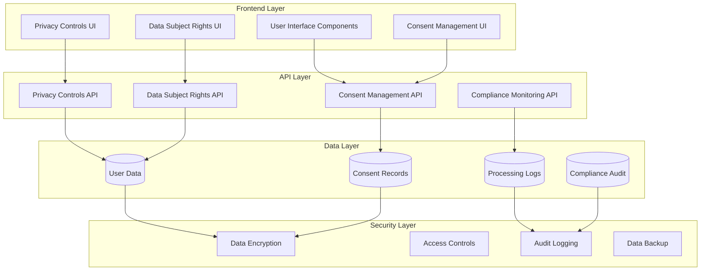
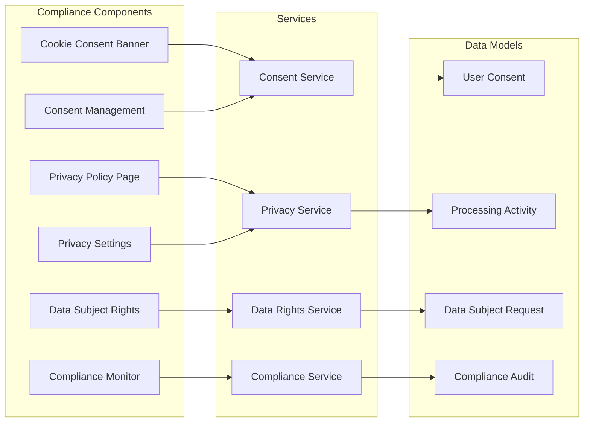

# Compliance Feature Design

## Overview

The compliance system ensures Udaman meets all applicable data protection and privacy regulations, including GDPR for EU users, CCPA for California residents, and other relevant US and international privacy laws. This design implements a comprehensive privacy-by-design approach with user-friendly controls and robust data protection measures.

## Architecture

### High-Level Architecture



### Component Architecture



## Components

### 1. Cookie Consent Banner

**Purpose**: Display cookie consent banner on first visit and manage user consent preferences.

**Features**:
- Automatic detection of first-time visitors
- Granular consent options (essential, analytics, marketing)
- Persistent consent storage with timestamps
- Withdrawal mechanism
- Multi-language support for international compliance

**Implementation**:
```typescript
interface CookieConsent {
  id: string;
  userId?: string;
  sessionId: string;
  essential: boolean;
  analytics: boolean;
  marketing: boolean;
  timestamp: Date;
  ipAddress: string;
  userAgent: string;
  consentVersion: string;
}
```

### 2. Privacy Policy Page

**Purpose**: Display comprehensive privacy policy with data collection practices.

**Features**:
- Detailed data collection information
- Processing purposes and legal basis
- Data retention periods
- Third-party sharing information
- User rights explanation
- Contact information for privacy inquiries

**Implementation**:
```typescript
interface PrivacyPolicy {
  version: string;
  effectiveDate: Date;
  sections: PrivacySection[];
  dataCategories: DataCategory[];
  processingPurposes: ProcessingPurpose[];
  retentionPeriods: RetentionPeriod[];
  userRights: UserRight[];
}
```

### 3. Consent Management System

**Purpose**: Manage user consent for data processing activities.

**Features**:
- Granular consent tracking by purpose
- Consent history and audit trail
- Consent withdrawal functionality
- Consent expiration management
- Consent renewal notifications

**Implementation**:
```typescript
interface UserConsent {
  id: string;
  userId: string;
  consentType: ConsentType;
  purpose: string;
  granted: boolean;
  timestamp: Date;
  ipAddress: string;
  userAgent: string;
  consentVersion: string;
  expiresAt?: Date;
  withdrawnAt?: Date;
}
```

### 4. Data Subject Rights Management

**Purpose**: Enable users to exercise their data protection rights.

**Features**:
- Data access requests
- Data correction requests
- Data deletion requests
- Data portability requests
- Processing restriction requests
- Objection to processing requests

**Implementation**:
```typescript
interface DataSubjectRequest {
  id: string;
  userId: string;
  requestType: DataSubjectRequestType;
  status: RequestStatus;
  submittedAt: Date;
  completedAt?: Date;
  description: string;
  attachments?: string[];
  response?: string;
  estimatedCompletion: Date;
}
```

### 5. Privacy Settings Dashboard

**Purpose**: Provide user-friendly interface for managing privacy preferences.

**Features**:
- Privacy preference controls
- Data processing opt-outs
- Marketing communication preferences
- Third-party sharing controls
- Data retention preferences

**Implementation**:
```typescript
interface PrivacySettings {
  userId: string;
  marketingEmails: boolean;
  analyticsTracking: boolean;
  thirdPartySharing: boolean;
  dataRetention: DataRetentionPreference;
  lastUpdated: Date;
}
```

### 6. Compliance Monitoring System

**Purpose**: Monitor and audit compliance with privacy regulations.

**Features**:
- Processing activity logging
- Consent compliance monitoring
- Data breach detection and notification
- Privacy impact assessments
- Compliance reporting

**Implementation**:
```typescript
interface ComplianceAudit {
  id: string;
  auditType: AuditType;
  timestamp: Date;
  userId?: string;
  action: string;
  dataCategory?: string;
  legalBasis?: string;
  consentId?: string;
  ipAddress: string;
  userAgent: string;
  result: AuditResult;
}
```

## Data Models

### User Consent Model

```typescript
interface UserConsent {
  id: string;
  userId: string;
  consentType: ConsentType;
  purpose: string;
  granted: boolean;
  timestamp: Date;
  ipAddress: string;
  userAgent: string;
  consentVersion: string;
  expiresAt?: Date;
  withdrawnAt?: Date;
  legalBasis: LegalBasis;
  dataCategories: string[];
  thirdParties: string[];
}

enum ConsentType {
  ESSENTIAL = 'essential',
  ANALYTICS = 'analytics',
  MARKETING = 'marketing',
  FUNCTIONAL = 'functional'
}

enum LegalBasis {
  CONSENT = 'consent',
  LEGITIMATE_INTEREST = 'legitimate_interest',
  CONTRACT = 'contract',
  LEGAL_OBLIGATION = 'legal_obligation'
}
```

### Processing Activity Model

```typescript
interface ProcessingActivity {
  id: string;
  userId: string;
  activityType: ProcessingActivityType;
  dataCategories: string[];
  purpose: string;
  legalBasis: LegalBasis;
  timestamp: Date;
  ipAddress: string;
  userAgent: string;
  consentId?: string;
  dataRetention: Date;
  thirdPartySharing: boolean;
  thirdParties?: string[];
}

enum ProcessingActivityType {
  USER_REGISTRATION = 'user_registration',
  COMPETITION_CREATION = 'competition_creation',
  EVENT_PARTICIPATION = 'event_participation',
  SCORE_ENTRY = 'score_entry',
  EMAIL_NOTIFICATION = 'email_notification',
  PAYMENT_PROCESSING = 'payment_processing'
}
```

### Data Subject Request Model

```typescript
interface DataSubjectRequest {
  id: string;
  userId: string;
  requestType: DataSubjectRequestType;
  status: RequestStatus;
  submittedAt: Date;
  completedAt?: Date;
  description: string;
  attachments?: string[];
  response?: string;
  estimatedCompletion: Date;
  priority: RequestPriority;
  assignedTo?: string;
  notes?: string[];
}

enum DataSubjectRequestType {
  ACCESS = 'access',
  CORRECTION = 'correction',
  DELETION = 'deletion',
  PORTABILITY = 'portability',
  RESTRICTION = 'restriction',
  OBJECTION = 'objection'
}

enum RequestStatus {
  SUBMITTED = 'submitted',
  IN_PROGRESS = 'in_progress',
  COMPLETED = 'completed',
  REJECTED = 'rejected',
  CANCELLED = 'cancelled'
}

enum RequestPriority {
  LOW = 'low',
  MEDIUM = 'medium',
  HIGH = 'high',
  URGENT = 'urgent'
}
```

## Services

### Consent Service

**Responsibilities**:
- Manage user consent collection and storage
- Track consent history and changes
- Handle consent withdrawal
- Manage consent expiration and renewal
- Validate consent for data processing

**Key Methods**:
```typescript
class ConsentService {
  async createConsent(consent: CreateConsentRequest): Promise<UserConsent>
  async updateConsent(consentId: string, updates: Partial<UserConsent>): Promise<UserConsent>
  async withdrawConsent(consentId: string): Promise<void>
  async getConsentHistory(userId: string): Promise<UserConsent[]>
  async validateConsent(userId: string, purpose: string): Promise<boolean>
  async getActiveConsents(userId: string): Promise<UserConsent[]>
}
```

### Privacy Service

**Responsibilities**:
- Manage privacy settings and preferences
- Handle data minimization
- Implement privacy controls
- Manage data retention policies
- Handle privacy policy updates

**Key Methods**:
```typescript
class PrivacyService {
  async updatePrivacySettings(userId: string, settings: Partial<PrivacySettings>): Promise<PrivacySettings>
  async getPrivacySettings(userId: string): Promise<PrivacySettings>
  async applyDataMinimization(userId: string): Promise<void>
  async enforceRetentionPolicies(): Promise<void>
  async updatePrivacyPolicy(version: string, content: PrivacyPolicy): Promise<void>
}
```

### Data Rights Service

**Responsibilities**:
- Process data subject rights requests
- Handle data access, correction, and deletion
- Manage data portability
- Process processing restrictions and objections
- Track request status and completion

**Key Methods**:
```typescript
class DataRightsService {
  async submitRequest(request: CreateDataSubjectRequest): Promise<DataSubjectRequest>
  async processAccessRequest(requestId: string): Promise<DataExport>
  async processCorrectionRequest(requestId: string, corrections: Record<string, any>): Promise<void>
  async processDeletionRequest(requestId: string): Promise<void>
  async processPortabilityRequest(requestId: string): Promise<DataExport>
  async updateRequestStatus(requestId: string, status: RequestStatus): Promise<DataSubjectRequest>
}
```

### Compliance Service

**Responsibilities**:
- Monitor compliance with privacy regulations
- Log processing activities
- Detect and report data breaches
- Generate compliance reports
- Conduct privacy impact assessments

**Key Methods**:
```typescript
class ComplianceService {
  async logProcessingActivity(activity: ProcessingActivity): Promise<void>
  async detectDataBreach(incident: DataBreachIncident): Promise<void>
  async notifyDataBreach(incident: DataBreachIncident): Promise<void>
  async generateComplianceReport(timeframe: DateRange): Promise<ComplianceReport>
  async conductPrivacyImpactAssessment(assessment: PrivacyImpactAssessment): Promise<AssessmentResult>
}
```

## Error Handling

### Consent Errors

```typescript
enum ConsentError {
  CONSENT_NOT_FOUND = 'consent_not_found',
  CONSENT_EXPIRED = 'consent_expired',
  CONSENT_ALREADY_WITHDRAWN = 'consent_already_withdrawn',
  INVALID_CONSENT_TYPE = 'invalid_consent_type',
  CONSENT_VERSION_MISMATCH = 'consent_version_mismatch'
}
```

### Data Rights Errors

```typescript
enum DataRightsError {
  REQUEST_NOT_FOUND = 'request_not_found',
  INVALID_REQUEST_TYPE = 'invalid_request_type',
  REQUEST_ALREADY_COMPLETED = 'request_already_completed',
  INSUFFICIENT_PERMISSIONS = 'insufficient_permissions',
  DATA_NOT_FOUND = 'data_not_found'
}
```

### Compliance Errors

```typescript
enum ComplianceError {
  PROCESSING_ACTIVITY_LOG_FAILED = 'processing_activity_log_failed',
  DATA_BREACH_NOTIFICATION_FAILED = 'data_breach_notification_failed',
  COMPLIANCE_REPORT_GENERATION_FAILED = 'compliance_report_generation_failed',
  AUDIT_LOG_FAILED = 'audit_log_failed'
}
```

## Testing Strategy

### Unit Tests

**Consent Management**:
- Consent creation and validation
- Consent withdrawal and expiration
- Consent history tracking
- Consent version management

**Data Rights**:
- Request submission and processing
- Data access and export
- Data correction and deletion
- Request status management

**Privacy Controls**:
- Privacy settings management
- Data minimization
- Retention policy enforcement
- Privacy policy updates

### Integration Tests

**End-to-End Workflows**:
- User registration with consent collection
- Privacy settings management
- Data subject rights request processing
- Compliance monitoring and reporting

**API Integration**:
- Consent API endpoints
- Privacy API endpoints
- Data rights API endpoints
- Compliance API endpoints

### Compliance Tests

**Regulatory Compliance**:
- GDPR compliance validation
- CCPA compliance validation
- Data protection requirements
- Privacy by design principles

**Security Tests**:
- Data encryption validation
- Access control verification
- Audit logging validation
- Data breach detection

## Performance Considerations

### Optimization Strategies

**Database Optimization**:
- Indexed queries for consent and request lookups
- Partitioned tables for audit logs
- Efficient data export generation
- Optimized compliance reporting

**Caching Strategy**:
- Cache active consents for quick validation
- Cache privacy settings for user sessions
- Cache compliance reports for reporting periods
- Cache privacy policy content

**API Performance**:
- Pagination for large data sets
- Asynchronous processing for data exports
- Background processing for compliance monitoring
- Optimized data serialization

### Scalability

**Horizontal Scaling**:
- Stateless service design
- Database connection pooling
- Load balancing for API endpoints
- Distributed caching

**Data Management**:
- Data archiving for old records
- Automated cleanup of expired data
- Efficient data export formats
- Compressed audit logs

## Security Implementation

### Data Protection

**Encryption**:
- AES-256 encryption for sensitive data
- TLS 1.3 for data in transit
- Encrypted database connections
- Encrypted backup storage

**Access Controls**:
- Role-based access control (RBAC)
- Principle of least privilege
- Multi-factor authentication for admin access
- Session management and timeout

**Audit Logging**:
- Comprehensive audit trails
- Immutable audit logs
- Real-time security monitoring
- Automated threat detection

### Privacy Controls

**Data Minimization**:
- Collect only necessary data
- Automatic data anonymization
- Pseudonymization for analytics
- Data retention enforcement

**Consent Management**:
- Granular consent tracking
- Consent withdrawal mechanisms
- Consent expiration handling
- Consent audit trails

## International Compliance

### GDPR Compliance

**Requirements Implementation**:
- Legal basis for processing
- Data subject rights
- Consent management
- Data protection impact assessments
- Data breach notification

**EU-Specific Features**:
- EU data localization
- Cross-border data transfer safeguards
- EU representative designation
- GDPR-compliant privacy notices

### CCPA Compliance

**Requirements Implementation**:
- Right to know about personal information
- Right to delete personal information
- Right to opt-out of sale
- Non-discrimination for exercising rights

**California-Specific Features**:
- California resident detection
- CCPA-compliant privacy notices
- Opt-out mechanisms
- Data disclosure requirements

### Other Jurisdictions

**Adaptive Compliance**:
- Jurisdiction detection
- Dynamic privacy policy generation
- Localized consent mechanisms
- Region-specific data handling

## Monitoring and Analytics

### Compliance Monitoring

**Real-Time Monitoring**:
- Consent compliance tracking
- Data processing activity monitoring
- Data breach detection
- Privacy impact assessment tracking

**Reporting and Analytics**:
- Compliance dashboard
- Privacy metrics reporting
- Data subject request analytics
- Consent rate analysis

### Alert System

**Automated Alerts**:
- Data breach notifications
- Consent expiration warnings
- Compliance violation alerts
- Performance degradation alerts

**Escalation Procedures**:
- Critical issue escalation
- Regulatory notification procedures
- Incident response protocols
- Stakeholder communication

## Deployment Considerations

### Environment Configuration

**Development Environment**:
- Local privacy policy testing
- Consent mechanism validation
- Data rights request testing
- Compliance monitoring setup

**Production Environment**:
- Secure configuration management
- Environment-specific privacy policies
- Production data protection measures
- Compliance monitoring deployment

### Data Migration

**Legacy Data Handling**:
- Existing user consent migration
- Historical data subject requests
- Privacy settings migration
- Audit log preservation

**Compliance Validation**:
- Pre-deployment compliance checks
- Data protection validation
- Privacy impact assessment
- Security audit completion

## Success Metrics

### Compliance Metrics

**Regulatory Compliance**:
- 100% GDPR compliance for EU users
- 100% CCPA compliance for California users
- Zero regulatory violations
- Complete audit trail coverage

**User Experience Metrics**:
- Consent banner acceptance rate > 90%
- Privacy settings completion rate > 80%
- Data rights request completion within 30 days
- Privacy policy comprehension rate > 85%

**Technical Metrics**:
- API response time < 200ms
- Data export completion < 24 hours
- Consent validation < 50ms
- Compliance report generation < 5 minutes

### Quality Assurance

**Testing Coverage**:
- 100% unit test coverage for core compliance functions
- 100% integration test coverage for user workflows
- 100% security test coverage for data protection
- 100% compliance test coverage for regulatory requirements

**Performance Benchmarks**:
- Consent validation: < 50ms
- Data export: < 24 hours
- Privacy settings update: < 100ms
- Compliance monitoring: Real-time
