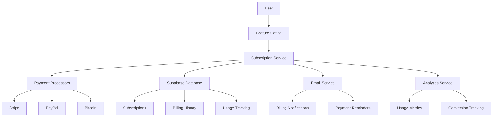
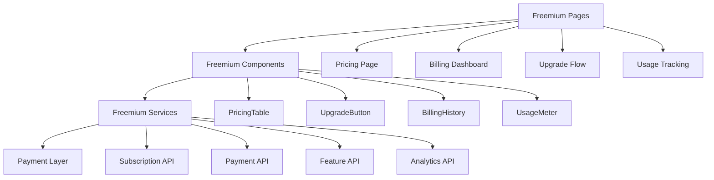

# Freemium Tiers System Design

## Overview
The freemium monetization system provides tiered functionality with clear value propositions, allowing users to access basic features for free while offering premium features through paid subscriptions. The system supports Stripe, PayPal, and Bitcoin payments with comprehensive subscription management and feature gating.

## Architecture

### High-Level Architecture


### Component Architecture


## Data Models

### Subscription
```typescript
interface Subscription {
  id: string;
  user_id: string;
  tier: 'free' | 'premium';
  status: 'active' | 'cancelled' | 'past_due' | 'unpaid';
  current_period_start: Date;
  current_period_end: Date;
  cancel_at_period_end: boolean;
  payment_method: 'stripe' | 'paypal' | 'bitcoin';
  payment_provider_id: string;
  amount: number;
  currency: string;
  created_at: Date;
  updated_at: Date;
  metadata: SubscriptionMetadata;
}

interface SubscriptionMetadata {
  trial_end?: Date;
  promotion_code?: string;
  source: 'web' | 'mobile' | 'api';
  referrer?: string;
}
```

### Billing History
```typescript
interface BillingHistory {
  id: string;
  user_id: string;
  subscription_id: string;
  amount: number;
  currency: string;
  status: 'succeeded' | 'failed' | 'pending' | 'refunded';
  payment_method: 'stripe' | 'paypal' | 'bitcoin';
  payment_provider_id: string;
  description: string;
  invoice_url?: string;
  created_at: Date;
  metadata: BillingMetadata;
}

interface BillingMetadata {
  tax_amount?: number;
  discount_amount?: number;
  promotion_code?: string;
  proration?: boolean;
}
```

### Usage Tracking
```typescript
interface UsageTracking {
  id: string;
  user_id: string;
  feature: string;
  usage_count: number;
  limit: number;
  period: 'monthly' | 'yearly';
  period_start: Date;
  period_end: Date;
  created_at: Date;
  updated_at: Date;
}

interface FeatureLimit {
  feature: string;
  free_limit: number;
  premium_limit: number;
  unit: 'count' | 'participants' | 'events' | 'storage_mb';
}
```

## Database Schema

### Subscriptions Table
```sql
CREATE TABLE subscriptions (
  id UUID PRIMARY KEY DEFAULT gen_random_uuid(),
  user_id UUID REFERENCES users(id) ON DELETE CASCADE,
  tier VARCHAR(20) DEFAULT 'free',
  status VARCHAR(20) DEFAULT 'active',
  current_period_start TIMESTAMP WITH TIME ZONE NOT NULL,
  current_period_end TIMESTAMP WITH TIME ZONE NOT NULL,
  cancel_at_period_end BOOLEAN DEFAULT FALSE,
  payment_method VARCHAR(20),
  payment_provider_id VARCHAR(255),
  amount DECIMAL(10,2),
  currency VARCHAR(3) DEFAULT 'USD',
  created_at TIMESTAMP WITH TIME ZONE DEFAULT NOW(),
  updated_at TIMESTAMP WITH TIME ZONE DEFAULT NOW(),
  metadata JSONB DEFAULT '{}',
  UNIQUE(user_id)
);

CREATE INDEX idx_subscriptions_user_id ON subscriptions(user_id);
CREATE INDEX idx_subscriptions_status ON subscriptions(status);
CREATE INDEX idx_subscriptions_tier ON subscriptions(tier);
```

### Billing History Table
```sql
CREATE TABLE billing_history (
  id UUID PRIMARY KEY DEFAULT gen_random_uuid(),
  user_id UUID REFERENCES users(id) ON DELETE CASCADE,
  subscription_id UUID REFERENCES subscriptions(id) ON DELETE CASCADE,
  amount DECIMAL(10,2) NOT NULL,
  currency VARCHAR(3) DEFAULT 'USD',
  status VARCHAR(20) NOT NULL,
  payment_method VARCHAR(20) NOT NULL,
  payment_provider_id VARCHAR(255),
  description TEXT NOT NULL,
  invoice_url TEXT,
  created_at TIMESTAMP WITH TIME ZONE DEFAULT NOW(),
  metadata JSONB DEFAULT '{}'
);

CREATE INDEX idx_billing_history_user_id ON billing_history(user_id);
CREATE INDEX idx_billing_history_subscription_id ON billing_history(subscription_id);
CREATE INDEX idx_billing_history_status ON billing_history(status);
CREATE INDEX idx_billing_history_created_at ON billing_history(created_at);
```

### Usage Tracking Table
```sql
CREATE TABLE usage_tracking (
  id UUID PRIMARY KEY DEFAULT gen_random_uuid(),
  user_id UUID REFERENCES users(id) ON DELETE CASCADE,
  feature VARCHAR(50) NOT NULL,
  usage_count INTEGER DEFAULT 0,
  limit INTEGER NOT NULL,
  period VARCHAR(20) DEFAULT 'monthly',
  period_start TIMESTAMP WITH TIME ZONE NOT NULL,
  period_end TIMESTAMP WITH TIME ZONE NOT NULL,
  created_at TIMESTAMP WITH TIME ZONE DEFAULT NOW(),
  updated_at TIMESTAMP WITH TIME ZONE DEFAULT NOW(),
  UNIQUE(user_id, feature, period_start)
);

CREATE INDEX idx_usage_tracking_user_id ON usage_tracking(user_id);
CREATE INDEX idx_usage_tracking_feature ON usage_tracking(feature);
CREATE INDEX idx_usage_tracking_period ON usage_tracking(period_start, period_end);
```

## Component Design

### Freemium Pages

#### Pricing Page (`/pricing`)
- **Purpose**: Display feature comparison and pricing options
- **Components**: PricingTable, FeatureComparison, UpgradeButton, TestimonialSection
- **Features**: Interactive feature comparison, upgrade flow initiation
- **Analytics**: Track pricing page views and upgrade clicks

#### Billing Dashboard (`/billing`)
- **Purpose**: Manage subscription and billing information
- **Components**: SubscriptionStatus, BillingHistory, PaymentMethod, CancelSubscription
- **Features**: View billing history, update payment methods, cancel subscription
- **Permissions**: User can only access their own billing information

#### Upgrade Flow (`/upgrade`)
- **Purpose**: Guide users through subscription upgrade process
- **Components**: UpgradeForm, PaymentMethodSelector, ConfirmationStep
- **Features**: Multiple payment options, secure payment processing
- **Validation**: Payment method validation, subscription eligibility

### Freemium Components

#### PricingTable Component
```typescript
interface PricingTableProps {
  currentTier: 'free' | 'premium';
  onUpgrade: (tier: 'premium') => void;
  onDowngrade: () => void;
}

interface PricingTableState {
  selectedTier: 'free' | 'premium';
  showAnnualPricing: boolean;
  isUpgrading: boolean;
}

interface PricingTier {
  name: string;
  price: {
    monthly: number;
    annual: number;
  };
  features: Feature[];
  limits: FeatureLimit[];
  popular?: boolean;
}
```

#### UpgradeButton Component
```typescript
interface UpgradeButtonProps {
  currentTier: 'free' | 'premium';
  targetTier: 'premium';
  onUpgrade: () => void;
  disabled?: boolean;
}

interface UpgradeButtonState {
  isProcessing: boolean;
  showPaymentModal: boolean;
  selectedPaymentMethod: PaymentMethod;
}
```

#### UsageMeter Component
```typescript
interface UsageMeterProps {
  feature: string;
  currentUsage: number;
  limit: number;
  unit: string;
  onUpgrade?: () => void;
}

interface UsageMeterState {
  percentage: number;
  isNearLimit: boolean;
  isOverLimit: boolean;
}
```

## Feature Gating System

### Feature Configuration
```typescript
interface FeatureConfig {
  // Feature definitions
  features: {
    [key: string]: {
      name: string;
      description: string;
      free_limit: number;
      premium_limit: number;
      unit: 'count' | 'participants' | 'events' | 'storage_mb';
      upgrade_prompt?: string;
    };
  };
  
  // Tier definitions
  tiers: {
    free: {
      name: string;
      price: 0;
      features: string[];
      limits: Record<string, number>;
    };
    premium: {
      name: string;
      price: {
        monthly: number;
        annual: number;
      };
      features: string[];
      limits: Record<string, number>;
    };
  };
}

const FEATURE_CONFIG: FeatureConfig = {
  features: {
    participants: {
      name: 'Competition Participants',
      description: 'Number of participants per competition',
      free_limit: 3,
      premium_limit: -1, // Unlimited
      unit: 'participants',
      upgrade_prompt: 'Upgrade to add more participants to your competitions'
    },
    competitions: {
      name: 'Active Competitions',
      description: 'Number of active competitions',
      free_limit: 1,
      premium_limit: -1,
      unit: 'count',
      upgrade_prompt: 'Upgrade to create multiple competitions'
    },
    events: {
      name: 'Events per Competition',
      description: 'Number of events per competition',
      free_limit: 3,
      premium_limit: -1,
      unit: 'events',
      upgrade_prompt: 'Upgrade to add more events to your competitions'
    },
    analytics: {
      name: 'Advanced Analytics',
      description: 'Detailed performance analytics',
      free_limit: 0,
      premium_limit: 1,
      unit: 'count',
      upgrade_prompt: 'Upgrade to access advanced analytics'
    },
    export: {
      name: 'Data Export',
      description: 'Export competition data',
      free_limit: 0,
      premium_limit: 1,
      unit: 'count',
      upgrade_prompt: 'Upgrade to export your competition data'
    }
  },
  tiers: {
    free: {
      name: 'Free',
      price: 0,
      features: ['basic_competitions', 'basic_scoring', 'basic_leaderboard'],
      limits: {
        participants: 3,
        competitions: 1,
        events: 3,
        analytics: 0,
        export: 0
      }
    },
    premium: {
      name: 'Premium',
      price: {
        monthly: 9.99,
        annual: 99.99
      },
      features: ['unlimited_competitions', 'advanced_scoring', 'advanced_analytics', 'data_export', 'priority_support'],
      limits: {
        participants: -1,
        competitions: -1,
        events: -1,
        analytics: 1,
        export: 1
      }
    }
  }
};
```

### Feature Gating Service
```typescript
class FeatureGatingService {
  // Check if user has access to a feature
  async hasFeatureAccess(userId: string, feature: string): Promise<boolean> {
    const subscription = await this.getUserSubscription(userId);
    const featureConfig = FEATURE_CONFIG.features[feature];
    
    if (!featureConfig) {
      return false;
    }
    
    const tier = subscription?.tier || 'free';
    const tierConfig = FEATURE_CONFIG.tiers[tier];
    
    return tierConfig.features.includes(feature);
  }
  
  // Check if user is within usage limits
  async isWithinLimit(userId: string, feature: string): Promise<boolean> {
    const subscription = await this.getUserSubscription(userId);
    const tier = subscription?.tier || 'free';
    const tierConfig = FEATURE_CONFIG.tiers[tier];
    const limit = tierConfig.limits[feature];
    
    if (limit === -1) {
      return true; // Unlimited
    }
    
    const usage = await this.getCurrentUsage(userId, feature);
    return usage < limit;
  }
  
  // Get current usage for a feature
  async getCurrentUsage(userId: string, feature: string): Promise<number> {
    const usage = await supabase
      .from('usage_tracking')
      .select('usage_count')
      .eq('user_id', userId)
      .eq('feature', feature)
      .gte('period_end', new Date())
      .single();
    
    return usage?.usage_count || 0;
  }
  
  // Increment usage for a feature
  async incrementUsage(userId: string, feature: string): Promise<void> {
    const now = new Date();
    const periodStart = new Date(now.getFullYear(), now.getMonth(), 1);
    const periodEnd = new Date(now.getFullYear(), now.getMonth() + 1, 0);
    
    await supabase
      .from('usage_tracking')
      .upsert({
        user_id: userId,
        feature,
        usage_count: 1,
        limit: FEATURE_CONFIG.tiers.free.limits[feature],
        period_start: periodStart,
        period_end: periodEnd
      }, {
        onConflict: 'user_id,feature,period_start'
      });
  }
}
```

## Payment Processing

### Payment Service
```typescript
interface PaymentService {
  // Create subscription
  createSubscription(userId: string, tier: 'premium', paymentMethod: PaymentMethod): Promise<Subscription>;
  
  // Update subscription
  updateSubscription(subscriptionId: string, updates: Partial<Subscription>): Promise<Subscription>;
  
  // Cancel subscription
  cancelSubscription(subscriptionId: string, cancelAtPeriodEnd?: boolean): Promise<void>;
  
  // Process payment
  processPayment(subscriptionId: string, amount: number): Promise<BillingHistory>;
  
  // Handle webhook
  handleWebhook(provider: PaymentProvider, payload: any): Promise<void>;
}

class StripePaymentService implements PaymentService {
  async createSubscription(userId: string, tier: 'premium', paymentMethod: PaymentMethod): Promise<Subscription> {
    const stripe = new Stripe(process.env.STRIPE_SECRET_KEY!);
    
    // Create customer if doesn't exist
    const user = await this.getUser(userId);
    let customer = await this.getStripeCustomer(user.email);
    
    if (!customer) {
      customer = await stripe.customers.create({
        email: user.email,
        metadata: { user_id: userId }
      });
    }
    
    // Create subscription
    const subscription = await stripe.subscriptions.create({
      customer: customer.id,
      items: [{ price: this.getPriceId(tier) }],
      payment_behavior: 'default_incomplete',
      payment_settings: { save_default_payment_method: 'on_subscription' },
      expand: ['latest_invoice.payment_intent']
    });
    
    // Save to database
    return this.saveSubscription(userId, tier, subscription);
  }
  
  async handleWebhook(payload: any): Promise<void> {
    const stripe = new Stripe(process.env.STRIPE_SECRET_KEY!);
    const event = stripe.webhooks.constructEvent(
      payload.body,
      payload.signature,
      process.env.STRIPE_WEBHOOK_SECRET!
    );
    
    switch (event.type) {
      case 'invoice.payment_succeeded':
        await this.handlePaymentSucceeded(event.data.object);
        break;
      case 'invoice.payment_failed':
        await this.handlePaymentFailed(event.data.object);
        break;
      case 'customer.subscription.deleted':
        await this.handleSubscriptionCancelled(event.data.object);
        break;
    }
  }
}
```

### PayPal Payment Service
```typescript
class PayPalPaymentService implements PaymentService {
  async createSubscription(userId: string, tier: 'premium', paymentMethod: PaymentMethod): Promise<Subscription> {
    const paypal = new PayPal(process.env.PAYPAL_CLIENT_ID!, process.env.PAYPAL_CLIENT_SECRET!);
    
    // Create billing plan
    const plan = await paypal.createBillingPlan({
      name: `Udaman ${tier} Plan`,
      description: `Udaman ${tier} subscription`,
      type: 'FIXED',
      payment_definitions: [{
        name: 'Regular Payments',
        type: 'REGULAR',
        frequency: 'MONTH',
        frequency_interval: '1',
        amount: {
          value: FEATURE_CONFIG.tiers[tier].price.monthly.toString(),
          currency: 'USD'
        }
      }]
    });
    
    // Create agreement
    const agreement = await paypal.createBillingAgreement({
      name: `Udaman ${tier} Agreement`,
      description: `Udaman ${tier} subscription agreement`,
      start_date: new Date(Date.now() + 24 * 60 * 60 * 1000).toISOString(),
      payer: {
        payment_method: 'paypal'
      },
      plan: {
        id: plan.id
      }
    });
    
    return this.saveSubscription(userId, tier, agreement);
  }
}
```

## Subscription Management

### Subscription Service
```typescript
class SubscriptionService {
  // Get user's current subscription
  async getUserSubscription(userId: string): Promise<Subscription | null> {
    const { data } = await supabase
      .from('subscriptions')
      .select('*')
      .eq('user_id', userId)
      .single();
    
    return data;
  }
  
  // Upgrade user to premium
  async upgradeToPremium(userId: string, paymentMethod: PaymentMethod): Promise<Subscription> {
    const paymentService = this.getPaymentService(paymentMethod.provider);
    const subscription = await paymentService.createSubscription(userId, 'premium', paymentMethod);
    
    // Update user tier
    await supabase
      .from('users')
      .update({ subscription_tier: 'premium' })
      .eq('id', userId);
    
    // Send welcome email
    await this.sendWelcomeEmail(userId, 'premium');
    
    return subscription;
  }
  
  // Cancel subscription
  async cancelSubscription(userId: string, cancelAtPeriodEnd: boolean = true): Promise<void> {
    const subscription = await this.getUserSubscription(userId);
    
    if (!subscription || subscription.tier === 'free') {
      throw new Error('No active subscription to cancel');
    }
    
    const paymentService = this.getPaymentService(subscription.payment_method);
    await paymentService.cancelSubscription(subscription.id, cancelAtPeriodEnd);
    
    if (!cancelAtPeriodEnd) {
      // Downgrade immediately
      await supabase
        .from('users')
        .update({ subscription_tier: 'free' })
        .eq('id', userId);
    }
  }
  
  // Check subscription status
  async checkSubscriptionStatus(userId: string): Promise<SubscriptionStatus> {
    const subscription = await this.getUserSubscription(userId);
    
    if (!subscription || subscription.tier === 'free') {
      return { tier: 'free', status: 'active' };
    }
    
    // Check if subscription is still valid
    if (subscription.current_period_end < new Date()) {
      // Subscription expired
      await this.handleExpiredSubscription(userId);
      return { tier: 'free', status: 'expired' };
    }
    
    return {
      tier: subscription.tier,
      status: subscription.status,
      current_period_end: subscription.current_period_end
    };
  }
}
```

## Analytics and Conversion Tracking

### Conversion Analytics
```typescript
interface ConversionAnalytics {
  // Track pricing page view
  trackPricingPageView(userId: string, source: string): void;
  
  // Track upgrade attempt
  trackUpgradeAttempt(userId: string, tier: string, paymentMethod: string): void;
  
  // Track successful upgrade
  trackUpgradeSuccess(userId: string, tier: string, paymentMethod: string): void;
  
  // Track upgrade failure
  trackUpgradeFailure(userId: string, tier: string, error: string): void;
  
  // Track feature usage
  trackFeatureUsage(userId: string, feature: string, usage: number): void;
  
  // Track limit reached
  trackLimitReached(userId: string, feature: string): void;
}

class AnalyticsService implements ConversionAnalytics {
  trackPricingPageView(userId: string, source: string): void {
    this.track('pricing_page_view', {
      user_id: userId,
      source,
      timestamp: new Date().toISOString()
    });
  }
  
  trackUpgradeSuccess(userId: string, tier: string, paymentMethod: string): void {
    this.track('upgrade_success', {
      user_id: userId,
      tier,
      payment_method: paymentMethod,
      timestamp: new Date().toISOString()
    });
  }
  
  trackLimitReached(userId: string, feature: string): void {
    this.track('limit_reached', {
      user_id: userId,
      feature,
      timestamp: new Date().toISOString()
    });
  }
  
  private track(event: string, properties: Record<string, any>): void {
    // Send to analytics service (e.g., Mixpanel, Amplitude)
    console.log('Analytics:', event, properties);
  }
}
```

## Error Handling

### Freemium Errors
```typescript
enum FreemiumErrorType {
  INSUFFICIENT_PERMISSIONS = 'insufficient_permissions',
  PAYMENT_FAILED = 'payment_failed',
  SUBSCRIPTION_NOT_FOUND = 'subscription_not_found',
  FEATURE_NOT_AVAILABLE = 'feature_not_available',
  USAGE_LIMIT_EXCEEDED = 'usage_limit_exceeded',
  PAYMENT_METHOD_INVALID = 'payment_method_invalid'
}

interface FreemiumError {
  type: FreemiumErrorType;
  message: string;
  feature?: string;
  currentUsage?: number;
  limit?: number;
  retryAfter?: number;
}
```

### Error Recovery Strategies
- **Insufficient Permissions**: Show upgrade prompt with feature comparison
- **Payment Failed**: Retry payment, suggest alternative payment method
- **Subscription Not Found**: Create new subscription, restore user access
- **Feature Not Available**: Show feature availability in current tier
- **Usage Limit Exceeded**: Show usage meter, prompt for upgrade
- **Payment Method Invalid**: Allow payment method update, retry payment

## Performance Considerations

### Optimization Strategies
- **Caching**: Cache subscription status and feature access
- **Lazy Loading**: Load billing information on demand
- **Background Processing**: Process webhooks and updates asynchronously
- **Rate Limiting**: Limit payment attempts and feature checks

### Performance Metrics
- **Feature Check**: < 100ms for access validation
- **Upgrade Flow**: < 30 seconds for complete upgrade
- **Payment Processing**: < 10 seconds for payment completion
- **Billing Dashboard**: < 2 seconds for page load
- **Usage Tracking**: < 50ms for usage increment

## Testing Strategy

### Unit Tests
- **Service Tests**: Test subscription and payment services
- **Component Tests**: Test all freemium components in isolation
- **Feature Tests**: Test feature gating and usage tracking
- **Payment Tests**: Test payment processing and webhook handling

### Integration Tests
- **Flow Tests**: Test complete upgrade and downgrade flows
- **Payment Tests**: Test payment processor integration
- **Webhook Tests**: Test webhook handling and subscription updates
- **Feature Tests**: Test feature access across different tiers

### E2E Tests
- **Upgrade Flow**: Complete subscription upgrade process
- **Billing Management**: Test billing dashboard functionality
- **Feature Gating**: Test feature access with different tiers
- **Payment Processing**: Test payment success and failure scenarios

## Success Criteria
- Free tier provides sufficient value to attract users
- Premium features provide clear value proposition
- Payment processing works reliably and securely
- Subscription management functions correctly
- Feature gating prevents unauthorized access
- Upgrade flow converts free users to paid subscribers
- Billing management provides clear user control
- All technical requirements are met for performance and security
