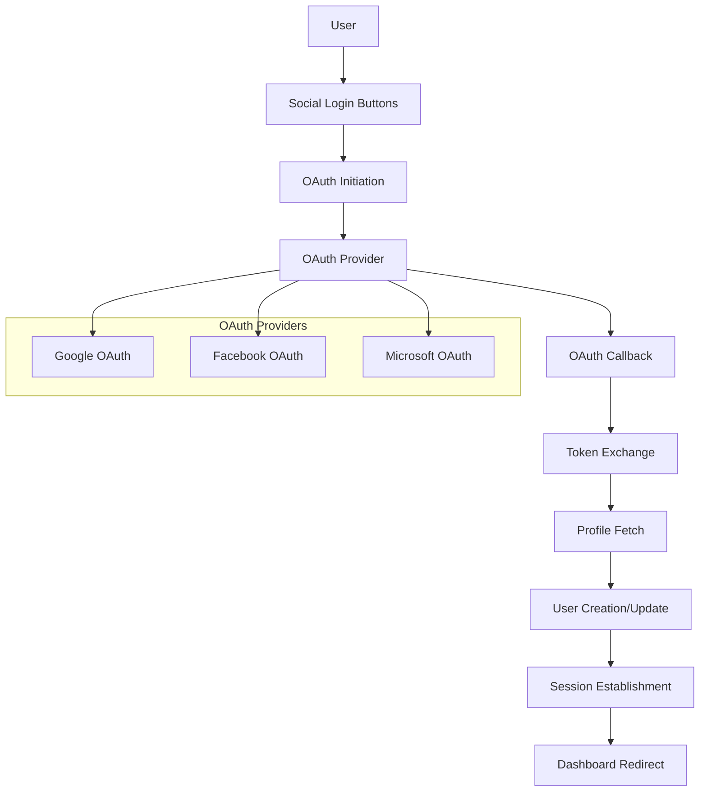
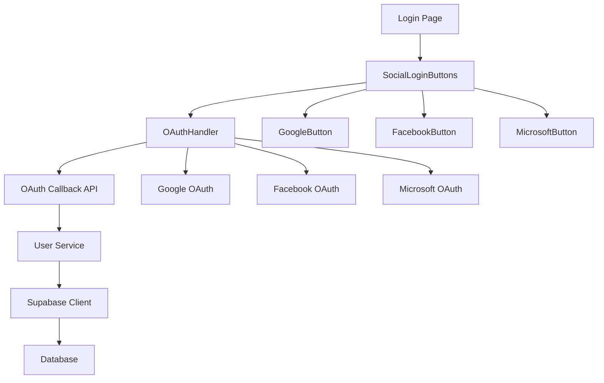
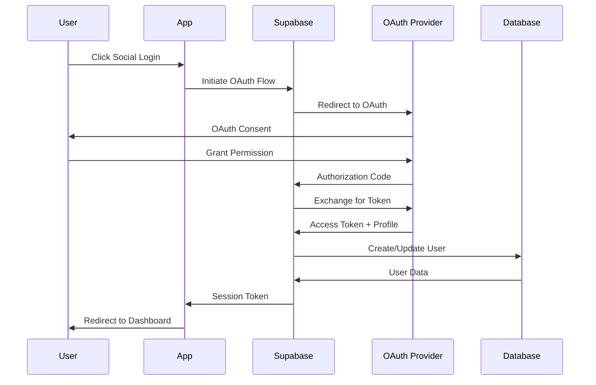

# OIDC Social Login Design

## Overview
The OIDC social login system integrates Google, Facebook, and Microsoft OAuth providers with the existing Supabase authentication system, providing seamless user authentication while maintaining security and user experience standards.

## Architecture

### High-Level Architecture


### Component Architecture


### Data Flow


## Component Design

### SocialLoginButtons Component
```typescript
interface SocialLoginButtonsProps {
  onSuccess?: (user: UserProfile) => void;
  onError?: (error: OAuthError) => void;
  redirectTo?: string;
  className?: string;
  disabled?: boolean;
}

interface OAuthError {
  provider: OIDCProvider;
  code: string;
  message: string;
  retryAfter?: number;
}
```

### OAuth Button Components
```typescript
interface OAuthButtonProps {
  provider: OIDCProvider;
  onSuccess?: (user: UserProfile) => void;
  onError?: (error: OAuthError) => void;
  redirectTo?: string;
  disabled?: boolean;
  className?: string;
}

interface OAuthConfig {
  clientId: string;
  clientSecret: string;
  redirectUri: string;
  scopes: string[];
  authorizationUrl: string;
  tokenUrl: string;
  profileUrl: string;
}
```

### OAuth Handler Service
```typescript
interface OAuthHandler {
  initiateAuth(provider: OIDCProvider, redirectTo?: string): Promise<string>;
  handleCallback(provider: OIDCProvider, code: string, state: string): Promise<UserProfile>;
  validateToken(provider: OIDCProvider, token: string): Promise<boolean>;
  fetchProfile(provider: OIDCProvider, token: string): Promise<OAuthProfile>;
}

interface OAuthProfile {
  id: string;
  email: string;
  displayName?: string;
  avatarUrl?: string;
  emailVerified: boolean;
  provider: OIDCProvider;
}
```

## API Design

### OAuth Callback Endpoint
```typescript
// POST /api/auth/oauth/callback
interface OAuthCallbackRequest {
  provider: OIDCProvider;
  code: string;
  state: string;
  error?: string;
  error_description?: string;
}

interface OAuthCallbackResponse {
  success: boolean;
  user?: UserProfile;
  error?: OAuthError;
  redirectTo?: string;
}
```

### OAuth Initiation Endpoint
```typescript
// GET /api/auth/oauth/initiate
interface OAuthInitiateRequest {
  provider: OIDCProvider;
  redirectTo?: string;
}

interface OAuthInitiateResponse {
  authorizationUrl: string;
  state: string;
  codeVerifier: string;
}
```

## Database Schema Updates

### User Profile Extensions
```sql
-- Add OAuth provider information to users table
ALTER TABLE users ADD COLUMN oauth_provider VARCHAR(20);
ALTER TABLE users ADD COLUMN oauth_provider_id VARCHAR(255);
ALTER TABLE users ADD COLUMN oauth_provider_data JSONB;

-- Add indexes for OAuth lookups
CREATE INDEX idx_users_oauth_provider ON users(oauth_provider);
CREATE INDEX idx_users_oauth_provider_id ON users(oauth_provider, oauth_provider_id);
```

### OAuth Sessions Table
```sql
-- Track OAuth sessions for security
CREATE TABLE oauth_sessions (
  id UUID PRIMARY KEY DEFAULT gen_random_uuid(),
  user_id UUID REFERENCES users(id) ON DELETE CASCADE,
  provider VARCHAR(20) NOT NULL,
  provider_session_id VARCHAR(255),
  access_token_hash VARCHAR(255),
  refresh_token_hash VARCHAR(255),
  expires_at TIMESTAMP WITH TIME ZONE,
  created_at TIMESTAMP WITH TIME ZONE DEFAULT NOW(),
  updated_at TIMESTAMP WITH TIME ZONE DEFAULT NOW()
);

CREATE INDEX idx_oauth_sessions_user_id ON oauth_sessions(user_id);
CREATE INDEX idx_oauth_sessions_provider ON oauth_sessions(provider);
CREATE INDEX idx_oauth_sessions_expires_at ON oauth_sessions(expires_at);
```

## Provider-Specific Implementation

### Google OAuth Configuration
```typescript
const GOOGLE_OAUTH_CONFIG: OAuthConfig = {
  clientId: process.env.GOOGLE_CLIENT_ID!,
  clientSecret: process.env.GOOGLE_CLIENT_SECRET!,
  redirectUri: `${process.env.NEXT_PUBLIC_APP_URL}/api/auth/oauth/callback/google`,
  scopes: ['openid', 'email', 'profile'],
  authorizationUrl: 'https://accounts.google.com/o/oauth2/v2/auth',
  tokenUrl: 'https://oauth2.googleapis.com/token',
  profileUrl: 'https://www.googleapis.com/oauth2/v2/userinfo'
};
```

### Facebook OAuth Configuration
```typescript
const FACEBOOK_OAUTH_CONFIG: OAuthConfig = {
  clientId: process.env.FACEBOOK_CLIENT_ID!,
  clientSecret: process.env.FACEBOOK_CLIENT_SECRET!,
  redirectUri: `${process.env.NEXT_PUBLIC_APP_URL}/api/auth/oauth/callback/facebook`,
  scopes: ['email', 'public_profile'],
  authorizationUrl: 'https://www.facebook.com/v18.0/dialog/oauth',
  tokenUrl: 'https://graph.facebook.com/v18.0/oauth/access_token',
  profileUrl: 'https://graph.facebook.com/v18.0/me'
};
```

### Microsoft OAuth Configuration
```typescript
const MICROSOFT_OAUTH_CONFIG: OAuthConfig = {
  clientId: process.env.MICROSOFT_CLIENT_ID!,
  clientSecret: process.env.MICROSOFT_CLIENT_SECRET!,
  redirectUri: `${process.env.NEXT_PUBLIC_APP_URL}/api/auth/oauth/callback/microsoft`,
  scopes: ['User.Read', 'email', 'profile', 'openid'],
  authorizationUrl: 'https://login.microsoftonline.com/common/oauth2/v2.0/authorize',
  tokenUrl: 'https://login.microsoftonline.com/common/oauth2/v2.0/token',
  profileUrl: 'https://graph.microsoft.com/v1.0/me'
};
```

## Security Implementation

### PKCE Implementation
```typescript
interface PKCEState {
  codeVerifier: string;
  codeChallenge: string;
  state: string;
  provider: OIDCProvider;
  redirectTo?: string;
}

function generatePKCEState(provider: OIDCProvider, redirectTo?: string): PKCEState {
  const codeVerifier = generateRandomString(128);
  const codeChallenge = generateCodeChallenge(codeVerifier);
  const state = generateRandomString(32);
  
  return {
    codeVerifier,
    codeChallenge,
    state,
    provider,
    redirectTo
  };
}
```

### State Management
```typescript
// Store PKCE state in secure session storage
function storePKCEState(state: PKCEState): void {
  const key = `oauth_state_${state.state}`;
  sessionStorage.setItem(key, JSON.stringify(state));
}

function retrievePKCEState(state: string): PKCEState | null {
  const key = `oauth_state_${state}`;
  const stored = sessionStorage.getItem(key);
  if (stored) {
    sessionStorage.removeItem(key); // Clean up after use
    return JSON.parse(stored);
  }
  return null;
}
```

## Error Handling

### OAuth Error Types
```typescript
enum OAuthErrorCode {
  INVALID_STATE = 'invalid_state',
  INVALID_CODE = 'invalid_code',
  TOKEN_EXCHANGE_FAILED = 'token_exchange_failed',
  PROFILE_FETCH_FAILED = 'profile_fetch_failed',
  USER_CREATION_FAILED = 'user_creation_failed',
  EMAIL_CONFLICT = 'email_conflict',
  PROVIDER_UNAVAILABLE = 'provider_unavailable',
  PERMISSION_DENIED = 'permission_denied',
  NETWORK_ERROR = 'network_error'
}

interface OAuthError {
  code: OAuthErrorCode;
  provider: OIDCProvider;
  message: string;
  details?: any;
  retryAfter?: number;
}
```

### Error Recovery Strategies
```typescript
const ERROR_RECOVERY_STRATEGIES: Record<OAuthErrorCode, string> = {
  [OAuthErrorCode.INVALID_STATE]: 'Please try signing in again',
  [OAuthErrorCode.INVALID_CODE]: 'Please try signing in again',
  [OAuthErrorCode.TOKEN_EXCHANGE_FAILED]: 'Authentication failed. Please try again',
  [OAuthErrorCode.PROFILE_FETCH_FAILED]: 'Unable to retrieve profile. Please try again',
  [OAuthErrorCode.USER_CREATION_FAILED]: 'Account creation failed. Please try again',
  [OAuthErrorCode.EMAIL_CONFLICT]: 'An account with this email already exists. Please sign in with email',
  [OAuthErrorCode.PROVIDER_UNAVAILABLE]: 'Service temporarily unavailable. Please try again later',
  [OAuthErrorCode.PERMISSION_DENIED]: 'Permission denied. Please grant required permissions',
  [OAuthErrorCode.NETWORK_ERROR]: 'Network error. Please check your connection and try again'
};
```

## Testing Strategy

### Unit Tests
- OAuth configuration validation
- PKCE state generation and validation
- Token exchange logic
- Profile data parsing
- Error handling logic

### Integration Tests
- Complete OAuth flows for each provider
- User creation and linking scenarios
- Error recovery mechanisms
- Session management integration

### E2E Tests
- Full OAuth authentication flows
- Cross-browser compatibility
- Mobile responsiveness
- Accessibility compliance

## Performance Considerations

### Caching Strategy
- Cache OAuth provider configurations
- Cache user profile data temporarily
- Implement token refresh optimization

### Optimization Techniques
- Lazy load OAuth provider SDKs
- Optimize redirect URI generation
- Minimize database queries during OAuth flow

## Monitoring and Analytics

### OAuth Metrics
- Authentication success rates by provider
- OAuth flow completion times
- Error rates and types
- User preference patterns

### Security Monitoring
- Failed OAuth attempts
- Suspicious OAuth patterns
- Token validation failures
- State parameter mismatches
