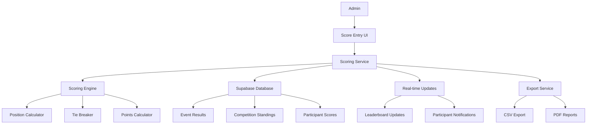
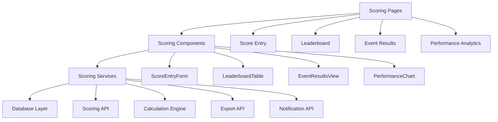

# Scoring System Design

## Overview
The scoring system implements sophisticated position-based points with tie-breaking logic, allowing competition administrators to enter event results and automatically calculate overall competition standings. The system provides real-time updates, comprehensive leaderboards, and detailed performance tracking.

## Architecture

### High-Level Architecture


### Component Architecture


## Data Models

### Event Result
```typescript
interface EventResult {
  id: string;
  event_id: string;
  competition_id: string;
  participant_id: string;
  score: number;
  position: number;
  points: number;
  tie_group?: number;
  notes?: string;
  entered_by: string;
  entered_at: Date;
  updated_at: Date;
  is_final: boolean;
}

interface EventResultInput {
  event_id: string;
  participant_id: string;
  score: number;
  notes?: string;
}
```

### Competition Standing
```typescript
interface CompetitionStanding {
  id: string;
  competition_id: string;
  participant_id: string;
  total_points: number;
  events_participated: number;
  events_won: number;
  events_placed_top_3: number;
  current_position: number;
  previous_position?: number;
  position_change: number;
  last_updated: Date;
  breakdown: EventBreakdown[];
}

interface EventBreakdown {
  event_id: string;
  event_name: string;
  position: number;
  points: number;
  score: number;
}
```

### Tie Group
```typescript
interface TieGroup {
  id: string;
  event_id: string;
  positions: number[];
  participants: string[];
  split_points: number;
  tie_breaker_applied?: string;
}
```

## Database Schema

### Event Results Table
```sql
CREATE TABLE event_results (
  id UUID PRIMARY KEY DEFAULT gen_random_uuid(),
  event_id UUID REFERENCES events(id) ON DELETE CASCADE,
  competition_id UUID REFERENCES competitions(id) ON DELETE CASCADE,
  participant_id UUID REFERENCES participants(id) ON DELETE CASCADE,
  score DECIMAL(10,2) NOT NULL,
  position INTEGER,
  points DECIMAL(10,2),
  tie_group INTEGER,
  notes TEXT,
  entered_by UUID REFERENCES users(id),
  entered_at TIMESTAMP WITH TIME ZONE DEFAULT NOW(),
  updated_at TIMESTAMP WITH TIME ZONE DEFAULT NOW(),
  is_final BOOLEAN DEFAULT FALSE,
  UNIQUE(event_id, participant_id)
);

CREATE INDEX idx_event_results_event_id ON event_results(event_id);
CREATE INDEX idx_event_results_competition_id ON event_results(competition_id);
CREATE INDEX idx_event_results_participant_id ON event_results(participant_id);
CREATE INDEX idx_event_results_position ON event_results(position);
```

### Competition Standings Table
```sql
CREATE TABLE competition_standings (
  id UUID PRIMARY KEY DEFAULT gen_random_uuid(),
  competition_id UUID REFERENCES competitions(id) ON DELETE CASCADE,
  participant_id UUID REFERENCES participants(id) ON DELETE CASCADE,
  total_points DECIMAL(10,2) DEFAULT 0,
  events_participated INTEGER DEFAULT 0,
  events_won INTEGER DEFAULT 0,
  events_placed_top_3 INTEGER DEFAULT 0,
  current_position INTEGER,
  previous_position INTEGER,
  position_change INTEGER DEFAULT 0,
  last_updated TIMESTAMP WITH TIME ZONE DEFAULT NOW(),
  breakdown JSONB DEFAULT '[]',
  UNIQUE(competition_id, participant_id)
);

CREATE INDEX idx_competition_standings_competition_id ON competition_standings(competition_id);
CREATE INDEX idx_competition_standings_position ON competition_standings(current_position);
CREATE INDEX idx_competition_standings_points ON competition_standings(total_points DESC);
```

### Tie Groups Table
```sql
CREATE TABLE tie_groups (
  id UUID PRIMARY KEY DEFAULT gen_random_uuid(),
  event_id UUID REFERENCES events(id) ON DELETE CASCADE,
  positions INTEGER[] NOT NULL,
  participants UUID[] NOT NULL,
  split_points DECIMAL(10,2) NOT NULL,
  tie_breaker_applied VARCHAR(100),
  created_at TIMESTAMP WITH TIME ZONE DEFAULT NOW()
);

CREATE INDEX idx_tie_groups_event_id ON tie_groups(event_id);
```

## Component Design

### Scoring Pages

#### Score Entry Page (`/competitions/[id]/events/[eventId]/scores`)
- **Purpose**: Primary interface for entering event results
- **Components**: ScoreEntryForm, ParticipantList, ScoreValidation, TieBreaker
- **Features**: Real-time validation, position calculation, tie detection
- **Validation**: Score format, participant validation, duplicate prevention

#### Leaderboard Page (`/competitions/[id]/leaderboard`)
- **Purpose**: Display current competition standings
- **Components**: LeaderboardTable, PerformanceChart, PositionHistory, ExportButton
- **Features**: Real-time updates, sorting, filtering, export options
- **Permissions**: View access for all participants, edit for admins

#### Event Results Page (`/competitions/[id]/events/[eventId]/results`)
- **Purpose**: Detailed view of event results and scoring
- **Components**: EventResultsTable, TieExplanation, ScoreBreakdown, EditButton
- **Features**: Result editing, tie explanations, score validation
- **Permissions**: View for all, edit for admins only

### Scoring Components

#### ScoreEntryForm Component
```typescript
interface ScoreEntryFormProps {
  eventId: string;
  participants: Participant[];
  onScoreSubmitted: (results: EventResult[]) => void;
  onError: (error: ScoringError) => void;
}

interface ScoreEntryFormState {
  scores: Record<string, number>;
  notes: Record<string, string>;
  isSubmitting: boolean;
  errors: Record<string, string>;
  validation: ScoreValidation;
}

interface ScoreValidation {
  isValid: boolean;
  missingScores: string[];
  invalidScores: string[];
  duplicateScores: string[];
}
```

#### LeaderboardTable Component
```typescript
interface LeaderboardTableProps {
  competitionId: string;
  standings: CompetitionStanding[];
  onStandingClick: (participantId: string) => void;
  onExport: (format: 'csv' | 'pdf') => void;
}

interface LeaderboardTableState {
  sortBy: 'position' | 'points' | 'events_won' | 'name';
  sortDirection: 'asc' | 'desc';
  filterBy: string;
  showPositionChange: boolean;
}
```

#### TieBreaker Component
```typescript
interface TieBreakerProps {
  tieGroup: TieGroup;
  participants: Participant[];
  onTieResolved: (resolution: TieResolution) => void;
}

interface TieResolution {
  tieGroupId: string;
  resolvedPositions: Record<string, number>;
  method: 'split_points' | 'tie_breaker_score' | 'manual';
}
```

## Scoring Algorithm

### Position-Based Scoring
```typescript
class PositionBasedScoring {
  // Calculate points for a position in an N-person event
  calculatePoints(position: number, totalParticipants: number): number {
    if (position < 1 || position > totalParticipants) {
      throw new Error(`Invalid position: ${position}`);
    }
    return totalParticipants - position + 1;
  }
  
  // Calculate positions from scores (lower is better for most events)
  calculatePositions(scores: Record<string, number>): Record<string, number> {
    const sortedScores = Object.entries(scores)
      .sort(([,a], [,b]) => a - b)
      .map(([participantId], index) => ({ participantId, position: index + 1 }));
    
    return Object.fromEntries(
      sortedScores.map(({ participantId, position }) => [participantId, position])
    );
  }
  
  // Handle ties by splitting points
  handleTies(scores: Record<string, number>): {
    positions: Record<string, number>;
    tieGroups: TieGroup[];
    points: Record<string, number>;
  } {
    // Group participants with same scores
    const scoreGroups = this.groupByScore(scores);
    const tieGroups: TieGroup[] = [];
    const positions: Record<string, number> = {};
    const points: Record<string, number> = {};
    
    let currentPosition = 1;
    
    for (const [score, participants] of scoreGroups) {
      if (participants.length === 1) {
        // No tie
        const participantId = participants[0];
        positions[participantId] = currentPosition;
        points[participantId] = this.calculatePoints(currentPosition, Object.keys(scores).length);
        currentPosition++;
      } else {
        // Tie detected
        const tiePositions = Array.from(
          { length: participants.length }, 
          (_, i) => currentPosition + i
        );
        const splitPoints = tiePositions.reduce((sum, pos) => 
          sum + this.calculatePoints(pos, Object.keys(scores).length), 0
        ) / participants.length;
        
        // Create tie group
        tieGroups.push({
          id: crypto.randomUUID(),
          event_id: '', // Set by caller
          positions: tiePositions,
          participants,
          split_points: splitPoints
        });
        
        // Assign positions and points
        participants.forEach(participantId => {
          positions[participantId] = currentPosition;
          points[participantId] = splitPoints;
        });
        
        currentPosition += participants.length;
      }
    }
    
    return { positions, tieGroups, points };
  }
  
  private groupByScore(scores: Record<string, number>): Map<number, string[]> {
    const groups = new Map<number, string[]>();
    
    Object.entries(scores).forEach(([participantId, score]) => {
      if (!groups.has(score)) {
        groups.set(score, []);
      }
      groups.get(score)!.push(participantId);
    });
    
    return groups;
  }
}
```

### Competition Standings Calculation
```typescript
class CompetitionStandingsCalculator {
  // Calculate overall competition standings
  async calculateStandings(competitionId: string): Promise<CompetitionStanding[]> {
    const eventResults = await this.getEventResults(competitionId);
    const participants = await this.getParticipants(competitionId);
    
    const standings = new Map<string, CompetitionStanding>();
    
    // Initialize standings for all participants
    participants.forEach(participant => {
      standings.set(participant.id, {
        id: crypto.randomUUID(),
        competition_id: competitionId,
        participant_id: participant.id,
        total_points: 0,
        events_participated: 0,
        events_won: 0,
        events_placed_top_3: 0,
        current_position: 0,
        previous_position: 0,
        position_change: 0,
        last_updated: new Date(),
        breakdown: []
      });
    });
    
    // Aggregate results by participant
    eventResults.forEach(result => {
      const standing = standings.get(result.participant_id);
      if (standing) {
        standing.total_points += result.points;
        standing.events_participated++;
        
        if (result.position === 1) {
          standing.events_won++;
        }
        if (result.position <= 3) {
          standing.events_placed_top_3++;
        }
        
        standing.breakdown.push({
          event_id: result.event_id,
          event_name: '', // Will be populated
          position: result.position,
          points: result.points,
          score: result.score
        });
      }
    });
    
    // Calculate positions
    const sortedStandings = Array.from(standings.values())
      .sort((a, b) => b.total_points - a.total_points);
    
    sortedStandings.forEach((standing, index) => {
      standing.current_position = index + 1;
    });
    
    return sortedStandings;
  }
}
```

## Real-Time Updates

### Supabase Realtime Integration
```typescript
interface ScoringRealtimeHandlers {
  // Listen for new event results
  onEventResultAdded: (result: EventResult) => void;
  
  // Listen for result updates
  onEventResultUpdated: (result: EventResult) => void;
  
  // Listen for standings updates
  onStandingsUpdated: (standings: CompetitionStanding[]) => void;
  
  // Listen for tie group changes
  onTieGroupUpdated: (tieGroup: TieGroup) => void;
}

class ScoringRealtimeService {
  // Subscribe to competition scoring updates
  subscribeToScoringUpdates(
    competitionId: string, 
    handlers: ScoringRealtimeHandlers
  ): () => void {
    const unsubscribe = supabase
      .channel(`scoring:${competitionId}`)
      .on('postgres_changes', 
        { event: 'INSERT', schema: 'public', table: 'event_results' },
        (payload) => handlers.onEventResultAdded(payload.new as EventResult)
      )
      .on('postgres_changes',
        { event: 'UPDATE', schema: 'public', table: 'event_results' },
        (payload) => handlers.onEventResultUpdated(payload.new as EventResult)
      )
      .on('postgres_changes',
        { event: 'UPDATE', schema: 'public', table: 'competition_standings' },
        (payload) => handlers.onStandingsUpdated([payload.new as CompetitionStanding])
      )
      .subscribe();
    
    return () => {
      supabase.removeChannel(`scoring:${competitionId}`);
    };
  }
}
```

## Error Handling

### Scoring Errors
```typescript
enum ScoringErrorType {
  INVALID_SCORE = 'invalid_score',
  DUPLICATE_RESULT = 'duplicate_result',
  MISSING_PARTICIPANT = 'missing_participant',
  INSUFFICIENT_PERMISSIONS = 'insufficient_permissions',
  CALCULATION_ERROR = 'calculation_error',
  NETWORK_ERROR = 'network_error'
}

interface ScoringError {
  type: ScoringErrorType;
  message: string;
  field?: string;
  participantId?: string;
  eventId?: string;
}
```

### Error Recovery Strategies
- **Invalid Score**: Highlight field, show valid range, suggest correction
- **Duplicate Result**: Show existing result, offer to update or cancel
- **Missing Participant**: Auto-complete from participant list, show validation
- **Insufficient Permissions**: Redirect to appropriate page, show permission explanation
- **Calculation Error**: Retry calculation, show error details, manual override option
- **Network Error**: Retry button with exponential backoff, offline mode support

## Performance Considerations

### Optimization Strategies
- **Batch Processing**: Process multiple results in single transaction
- **Caching**: Cache standings calculations and participant data
- **Incremental Updates**: Update only changed standings
- **Background Processing**: Calculate standings in background for large competitions

### Performance Metrics
- **Score Entry**: < 1 second per result
- **Position Calculation**: < 500ms for 50 participants
- **Standings Update**: < 2 seconds for complete recalculation
- **Leaderboard Load**: < 1 second for competition overview
- **Real-Time Updates**: < 200ms for UI updates

## Testing Strategy

### Unit Tests
- **Algorithm Tests**: Test position calculation and tie-breaking logic
- **Component Tests**: Test all scoring components in isolation
- **Service Tests**: Test scoring services and API integration
- **Validation Tests**: Test score validation and error handling

### Integration Tests
- **Flow Tests**: Test complete score entry and calculation flows
- **API Tests**: Test Supabase integration and real-time features
- **Permission Tests**: Test role-based access control for scoring
- **Data Integrity Tests**: Test data consistency across tables

### E2E Tests
- **Score Entry**: Complete score entry process
- **Leaderboard Updates**: Verify real-time leaderboard updates
- **Tie Breaking**: Test tie detection and resolution
- **Export Features**: Test data export functionality

## Export and Reporting

### Data Export
```typescript
interface ExportService {
  // Export competition standings to CSV
  exportStandingsToCSV(competitionId: string): Promise<string>;
  
  // Export event results to CSV
  exportEventResultsToCSV(eventId: string): Promise<string>;
  
  // Generate PDF report
  generatePDFReport(competitionId: string): Promise<Buffer>;
  
  // Export participant performance history
  exportParticipantHistory(participantId: string): Promise<string>;
}

class CSVExporter {
  exportStandings(standings: CompetitionStanding[]): string {
    const headers = [
      'Position', 'Participant', 'Total Points', 'Events Participated',
      'Events Won', 'Top 3 Finishes', 'Position Change'
    ];
    
    const rows = standings.map(standing => [
      standing.current_position,
      standing.participant_id, // Will be resolved to name
      standing.total_points,
      standing.events_participated,
      standing.events_won,
      standing.events_placed_top_3,
      standing.position_change
    ]);
    
    return this.generateCSV(headers, rows);
  }
}
```

## Monitoring and Analytics

### Scoring Metrics
- **Score Entry Rate**: Track how quickly results are entered
- **Tie Frequency**: Monitor how often ties occur
- **Calculation Performance**: Track scoring algorithm performance
- **Error Rates**: Monitor scoring error frequency
- **Export Usage**: Track report generation frequency

### Performance Monitoring
- **Calculation Time**: Monitor scoring calculation performance
- **Real-Time Latency**: Monitor real-time update performance
- **Database Queries**: Monitor query performance and optimization
- **Export Performance**: Monitor export generation time

## Success Criteria
- Position-based scoring works correctly for all scenarios
- Tie-breaking logic produces fair and accurate results
- Real-time updates function reliably across all devices
- Score entry interface is intuitive and error-free
- Leaderboard displays accurate and up-to-date standings
- Export functionality provides comprehensive data access
- Performance meets all specified requirements
- All technical requirements are met for security and reliability
