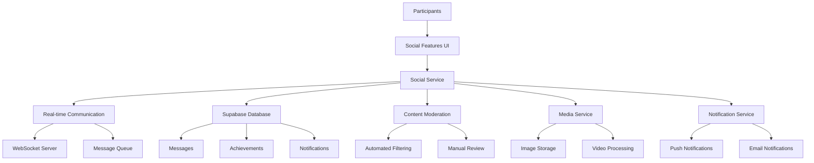
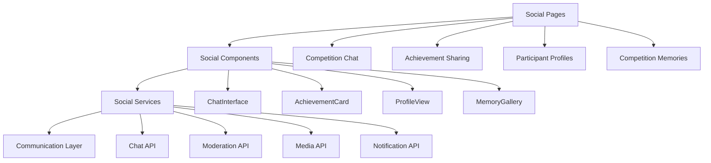

# Social Features System Design

## Overview
The social features system enables friendly rivalry, banter, and camaraderie among competition participants, fostering the traditional spirit of the Udaman competition through digital interactions. The system provides real-time communication, achievement sharing, and community building features.

## Architecture

### High-Level Architecture


### Component Architecture


## Data Models

### Message
```typescript
interface Message {
  id: string;
  competition_id: string;
  sender_id: string;
  content: string;
  message_type: 'text' | 'image' | 'video' | 'achievement' | 'system';
  media_url?: string;
  mentions: string[];
  reply_to?: string;
  is_edited: boolean;
  edited_at?: Date;
  is_deleted: boolean;
  deleted_at?: Date;
  moderation_status: 'pending' | 'approved' | 'flagged' | 'removed';
  created_at: Date;
  updated_at: Date;
}

interface MessageInput {
  competition_id: string;
  content: string;
  message_type: 'text' | 'image' | 'video' | 'achievement';
  media_url?: string;
  mentions?: string[];
  reply_to?: string;
}
```

### Achievement
```typescript
interface Achievement {
  id: string;
  competition_id: string;
  participant_id: string;
  achievement_type: 'event_winner' | 'competition_winner' | 'ballerina_trophy' | 'personal_best' | 'streak' | 'custom';
  title: string;
  description: string;
  event_id?: string;
  position?: number;
  score?: number;
  media_url?: string;
  shared_at: Date;
  likes_count: number;
  comments_count: number;
  created_at: Date;
}

interface AchievementShare {
  achievement_id: string;
  shared_by: string;
  message?: string;
  social_platforms: ('twitter' | 'facebook' | 'instagram')[];
  created_at: Date;
}
```

### Participant Profile
```typescript
interface ParticipantProfile {
  id: string;
  user_id: string;
  display_name: string;
  avatar_url?: string;
  bio?: string;
  location?: string;
  achievements: Achievement[];
  competition_stats: CompetitionStats;
  social_links: SocialLinks;
  privacy_settings: PrivacySettings;
  created_at: Date;
  updated_at: Date;
}

interface CompetitionStats {
  total_competitions: number;
  competitions_won: number;
  events_won: number;
  total_points: number;
  average_position: number;
  best_performance: string;
  favorite_event: string;
}

interface SocialLinks {
  twitter?: string;
  instagram?: string;
  linkedin?: string;
  website?: string;
}

interface PrivacySettings {
  profile_visible: boolean;
  achievements_public: boolean;
  stats_public: boolean;
  allow_messages: boolean;
}
```

### Competition Memory
```typescript
interface CompetitionMemory {
  id: string;
  competition_id: string;
  title: string;
  description: string;
  memory_type: 'highlight' | 'funny_moment' | 'achievement' | 'group_photo' | 'video_clip';
  media_urls: string[];
  participants_tagged: string[];
  created_by: string;
  likes_count: number;
  comments_count: number;
  shared_count: number;
  created_at: Date;
  updated_at: Date;
}

interface MemoryComment {
  id: string;
  memory_id: string;
  commenter_id: string;
  content: string;
  is_edited: boolean;
  edited_at?: Date;
  created_at: Date;
}
```

## Database Schema

### Messages Table
```sql
CREATE TABLE messages (
  id UUID PRIMARY KEY DEFAULT gen_random_uuid(),
  competition_id UUID REFERENCES competitions(id) ON DELETE CASCADE,
  sender_id UUID REFERENCES users(id) ON DELETE CASCADE,
  content TEXT NOT NULL,
  message_type VARCHAR(20) DEFAULT 'text',
  media_url TEXT,
  mentions UUID[] DEFAULT '{}',
  reply_to UUID REFERENCES messages(id) ON DELETE SET NULL,
  is_edited BOOLEAN DEFAULT FALSE,
  edited_at TIMESTAMP WITH TIME ZONE,
  is_deleted BOOLEAN DEFAULT FALSE,
  deleted_at TIMESTAMP WITH TIME ZONE,
  moderation_status VARCHAR(20) DEFAULT 'pending',
  created_at TIMESTAMP WITH TIME ZONE DEFAULT NOW(),
  updated_at TIMESTAMP WITH TIME ZONE DEFAULT NOW()
);

CREATE INDEX idx_messages_competition_id ON messages(competition_id);
CREATE INDEX idx_messages_sender_id ON messages(sender_id);
CREATE INDEX idx_messages_created_at ON messages(created_at);
CREATE INDEX idx_messages_moderation_status ON messages(moderation_status);
```

### Achievements Table
```sql
CREATE TABLE achievements (
  id UUID PRIMARY KEY DEFAULT gen_random_uuid(),
  competition_id UUID REFERENCES competitions(id) ON DELETE CASCADE,
  participant_id UUID REFERENCES participants(id) ON DELETE CASCADE,
  achievement_type VARCHAR(30) NOT NULL,
  title VARCHAR(255) NOT NULL,
  description TEXT,
  event_id UUID REFERENCES events(id) ON DELETE SET NULL,
  position INTEGER,
  score DECIMAL(10,2),
  media_url TEXT,
  shared_at TIMESTAMP WITH TIME ZONE DEFAULT NOW(),
  likes_count INTEGER DEFAULT 0,
  comments_count INTEGER DEFAULT 0,
  created_at TIMESTAMP WITH TIME ZONE DEFAULT NOW()
);

CREATE INDEX idx_achievements_competition_id ON achievements(competition_id);
CREATE INDEX idx_achievements_participant_id ON achievements(participant_id);
CREATE INDEX idx_achievements_type ON achievements(achievement_type);
CREATE INDEX idx_achievements_shared_at ON achievements(shared_at);
```

### Participant Profiles Table
```sql
CREATE TABLE participant_profiles (
  id UUID PRIMARY KEY DEFAULT gen_random_uuid(),
  user_id UUID REFERENCES users(id) ON DELETE CASCADE,
  display_name VARCHAR(100) NOT NULL,
  avatar_url TEXT,
  bio TEXT,
  location VARCHAR(255),
  competition_stats JSONB DEFAULT '{}',
  social_links JSONB DEFAULT '{}',
  privacy_settings JSONB DEFAULT '{}',
  created_at TIMESTAMP WITH TIME ZONE DEFAULT NOW(),
  updated_at TIMESTAMP WITH TIME ZONE DEFAULT NOW(),
  UNIQUE(user_id)
);

CREATE INDEX idx_participant_profiles_user_id ON participant_profiles(user_id);
CREATE INDEX idx_participant_profiles_display_name ON participant_profiles(display_name);
```

### Competition Memories Table
```sql
CREATE TABLE competition_memories (
  id UUID PRIMARY KEY DEFAULT gen_random_uuid(),
  competition_id UUID REFERENCES competitions(id) ON DELETE CASCADE,
  title VARCHAR(255) NOT NULL,
  description TEXT,
  memory_type VARCHAR(30) NOT NULL,
  media_urls TEXT[] DEFAULT '{}',
  participants_tagged UUID[] DEFAULT '{}',
  created_by UUID REFERENCES users(id) ON DELETE CASCADE,
  likes_count INTEGER DEFAULT 0,
  comments_count INTEGER DEFAULT 0,
  shared_count INTEGER DEFAULT 0,
  created_at TIMESTAMP WITH TIME ZONE DEFAULT NOW(),
  updated_at TIMESTAMP WITH TIME ZONE DEFAULT NOW()
);

CREATE INDEX idx_competition_memories_competition_id ON competition_memories(competition_id);
CREATE INDEX idx_competition_memories_created_by ON competition_memories(created_by);
CREATE INDEX idx_competition_memories_type ON competition_memories(memory_type);
CREATE INDEX idx_competition_memories_created_at ON competition_memories(created_at);
```

## Component Design

### Social Pages

#### Competition Chat Page (`/competitions/[id]/chat`)
- **Purpose**: Real-time communication hub for competition participants
- **Components**: ChatInterface, MessageInput, ParticipantList, ModerationPanel
- **Features**: Real-time messaging, media sharing, mentions, moderation
- **Permissions**: View for all participants, moderate for admins

#### Achievement Gallery (`/competitions/[id]/achievements`)
- **Purpose**: Display and share competition achievements
- **Components**: AchievementGrid, AchievementCard, ShareButton, FilterControls
- **Features**: Achievement sharing, social media integration, filtering
- **Analytics**: Track achievement views and shares

#### Participant Profile Page (`/participants/[id]`)
- **Purpose**: Show participant information and achievements
- **Components**: ProfileHeader, AchievementTimeline, CompetitionHistory, SocialLinks
- **Features**: Achievement showcase, competition history, social connections
- **Privacy**: Respect user privacy settings

#### Competition Memories (`/competitions/[id]/memories`)
- **Purpose**: Preserve and share competition highlights
- **Components**: MemoryGallery, MemoryCard, UploadButton, TimelineView
- **Features**: Media upload, tagging, commenting, sharing
- **Moderation**: Content moderation for uploaded media

### Social Components

#### ChatInterface Component
```typescript
interface ChatInterfaceProps {
  competitionId: string;
  currentUserId: string;
  onMessageSent: (message: Message) => void;
  onMessageReceived: (message: Message) => void;
}

interface ChatInterfaceState {
  messages: Message[];
  isLoading: boolean;
  hasMoreMessages: boolean;
  isTyping: boolean;
  typingUsers: string[];
  scrollPosition: number;
}
```

#### AchievementCard Component
```typescript
interface AchievementCardProps {
  achievement: Achievement;
  onLike: (achievementId: string) => void;
  onShare: (achievementId: string, platforms: string[]) => void;
  onComment: (achievementId: string, comment: string) => void;
}

interface AchievementCardState {
  isLiked: boolean;
  showComments: boolean;
  isSharing: boolean;
  sharePlatforms: string[];
}
```

#### MessageInput Component
```typescript
interface MessageInputProps {
  competitionId: string;
  onSendMessage: (message: MessageInput) => void;
  onTyping: (isTyping: boolean) => void;
  replyTo?: Message;
}

interface MessageInputState {
  content: string;
  mediaFiles: File[];
  mentions: string[];
  isSubmitting: boolean;
  characterCount: number;
  showEmojiPicker: boolean;
}
```

## Real-Time Communication

### WebSocket Integration
```typescript
interface ChatRealtimeHandlers {
  // Listen for new messages
  onMessageReceived: (message: Message) => void;
  
  // Listen for message updates
  onMessageUpdated: (message: Message) => void;
  
  // Listen for typing indicators
  onTypingStarted: (userId: string) => void;
  onTypingStopped: (userId: string) => void;
  
  // Listen for user presence
  onUserJoined: (userId: string) => void;
  onUserLeft: (userId: string) => void;
}

class ChatRealtimeService {
  // Subscribe to competition chat
  subscribeToChat(
    competitionId: string, 
    handlers: ChatRealtimeHandlers
  ): () => void {
    const unsubscribe = supabase
      .channel(`chat:${competitionId}`)
      .on('postgres_changes', 
        { event: 'INSERT', schema: 'public', table: 'messages' },
        (payload) => handlers.onMessageReceived(payload.new as Message)
      )
      .on('postgres_changes',
        { event: 'UPDATE', schema: 'public', table: 'messages' },
        (payload) => handlers.onMessageUpdated(payload.new as Message)
      )
      .on('broadcast', { event: 'typing_started' },
        (payload) => handlers.onTypingStarted(payload.userId)
      )
      .on('broadcast', { event: 'typing_stopped' },
        (payload) => handlers.onTypingStopped(payload.userId)
      )
      .subscribe();
    
    return () => {
      supabase.removeChannel(`chat:${competitionId}`);
    };
  }
  
  // Send typing indicator
  sendTypingIndicator(competitionId: string, isTyping: boolean): void {
    supabase
      .channel(`chat:${competitionId}`)
      .send({
        type: 'broadcast',
        event: isTyping ? 'typing_started' : 'typing_stopped',
        payload: { userId: getCurrentUserId() }
      });
  }
}
```

## Content Moderation

### Moderation Service
```typescript
interface ModerationService {
  // Check message content
  checkMessageContent(content: string): Promise<ModerationResult>;
  
  // Check media content
  checkMediaContent(mediaUrl: string): Promise<ModerationResult>;
  
  // Report inappropriate content
  reportContent(contentId: string, contentType: string, reason: string): Promise<void>;
  
  // Get moderation queue
  getModerationQueue(): Promise<ModerationItem[]>;
  
  // Approve or reject content
  moderateContent(contentId: string, action: 'approve' | 'reject', reason?: string): Promise<void>;
}

interface ModerationResult {
  isApproved: boolean;
  confidence: number;
  flags: string[];
  suggestedAction: 'approve' | 'review' | 'reject';
}

class ContentModerationService implements ModerationService {
  async checkMessageContent(content: string): Promise<ModerationResult> {
    // Check for inappropriate language
    const inappropriateWords = await this.getInappropriateWords();
    const foundWords = inappropriateWords.filter(word => 
      content.toLowerCase().includes(word.toLowerCase())
    );
    
    // Check for spam patterns
    const spamScore = this.calculateSpamScore(content);
    
    // Check for harassment patterns
    const harassmentScore = this.calculateHarassmentScore(content);
    
    const flags = [];
    if (foundWords.length > 0) flags.push('inappropriate_language');
    if (spamScore > 0.7) flags.push('spam');
    if (harassmentScore > 0.8) flags.push('harassment');
    
    const isApproved = flags.length === 0;
    const confidence = Math.max(spamScore, harassmentScore);
    
    return {
      isApproved,
      confidence,
      flags,
      suggestedAction: isApproved ? 'approve' : confidence > 0.9 ? 'reject' : 'review'
    };
  }
  
  private calculateSpamScore(content: string): number {
    // Implement spam detection logic
    const spamPatterns = [
      /\b(?:buy|sell|discount|offer|limited|act now)\b/gi,
      /(.)\1{4,}/g, // Repeated characters
      /[A-Z]{5,}/g, // ALL CAPS
      /\b(?:http|www)\b/gi // URLs
    ];
    
    let score = 0;
    spamPatterns.forEach(pattern => {
      const matches = content.match(pattern);
      if (matches) score += matches.length * 0.1;
    });
    
    return Math.min(score, 1);
  }
  
  private calculateHarassmentScore(content: string): number {
    // Implement harassment detection logic
    const harassmentPatterns = [
      /\b(?:kill|die|hate|stupid|idiot|dumb)\b/gi,
      /@\w+/g, // Mentions
      /!{3,}/g // Excessive punctuation
    ];
    
    let score = 0;
    harassmentPatterns.forEach(pattern => {
      const matches = content.match(pattern);
      if (matches) score += matches.length * 0.2;
    });
    
    return Math.min(score, 1);
  }
}
```

## Achievement System

### Achievement Service
```typescript
interface AchievementService {
  // Create achievement
  createAchievement(achievement: Omit<Achievement, 'id' | 'created_at'>): Promise<Achievement>;
  
  // Share achievement
  shareAchievement(achievementId: string, platforms: string[]): Promise<void>;
  
  // Like achievement
  likeAchievement(achievementId: string, userId: string): Promise<void>;
  
  // Get user achievements
  getUserAchievements(userId: string): Promise<Achievement[]>;
  
  // Get competition achievements
  getCompetitionAchievements(competitionId: string): Promise<Achievement[]>;
}

class AchievementService implements AchievementService {
  async createAchievement(achievement: Omit<Achievement, 'id' | 'created_at'>): Promise<Achievement> {
    const { data, error } = await supabase
      .from('achievements')
      .insert(achievement)
      .select()
      .single();
    
    if (error) throw error;
    
    // Send notification to competition participants
    await this.notifyAchievement(data);
    
    return data;
  }
  
  async shareAchievement(achievementId: string, platforms: string[]): Promise<void> {
    const achievement = await this.getAchievement(achievementId);
    
    for (const platform of platforms) {
      switch (platform) {
        case 'twitter':
          await this.shareToTwitter(achievement);
          break;
        case 'facebook':
          await this.shareToFacebook(achievement);
          break;
        case 'instagram':
          await this.shareToInstagram(achievement);
          break;
      }
    }
    
    // Update share count
    await supabase
      .from('achievements')
      .update({ shared_count: achievement.shared_count + 1 })
      .eq('id', achievementId);
  }
  
  private async shareToTwitter(achievement: Achievement): Promise<void> {
    const text = `🏆 ${achievement.title} - ${achievement.description}`;
    const url = `${process.env.NEXT_PUBLIC_APP_URL}/achievements/${achievement.id}`;
    
    // Use Twitter API to share
    // Implementation depends on Twitter API access
  }
}
```

## Media Management

### Media Service
```typescript
interface MediaService {
  // Upload image
  uploadImage(file: File, competitionId: string): Promise<string>;
  
  // Upload video
  uploadVideo(file: File, competitionId: string): Promise<string>;
  
  // Process media
  processMedia(mediaUrl: string, type: 'image' | 'video'): Promise<ProcessedMedia>;
  
  // Delete media
  deleteMedia(mediaUrl: string): Promise<void>;
}

interface ProcessedMedia {
  originalUrl: string;
  thumbnailUrl: string;
  optimizedUrl: string;
  metadata: {
    width: number;
    height: number;
    duration?: number;
    size: number;
    format: string;
  };
}

class MediaService implements MediaService {
  async uploadImage(file: File, competitionId: string): Promise<string> {
    const fileName = `${competitionId}/${Date.now()}-${file.name}`;
    
    const { data, error } = await supabase.storage
      .from('competition-media')
      .upload(fileName, file, {
        cacheControl: '3600',
        upsert: false
      });
    
    if (error) throw error;
    
    // Process image for optimization
    const processedMedia = await this.processMedia(data.path, 'image');
    
    return processedMedia.optimizedUrl;
  }
  
  async processMedia(mediaUrl: string, type: 'image' | 'video'): Promise<ProcessedMedia> {
    if (type === 'image') {
      return this.processImage(mediaUrl);
    } else {
      return this.processVideo(mediaUrl);
    }
  }
  
  private async processImage(imageUrl: string): Promise<ProcessedMedia> {
    // Use Sharp or similar library for image processing
    // Create thumbnail and optimized versions
    // Return processed media URLs
    return {
      originalUrl: imageUrl,
      thumbnailUrl: imageUrl.replace('/original/', '/thumbnails/'),
      optimizedUrl: imageUrl.replace('/original/', '/optimized/'),
      metadata: {
        width: 1920,
        height: 1080,
        size: 1024000,
        format: 'jpeg'
      }
    };
  }
}
```

## Notification System

### Notification Service
```typescript
interface NotificationService {
  // Send push notification
  sendPushNotification(userId: string, notification: PushNotification): Promise<void>;
  
  // Send email notification
  sendEmailNotification(userId: string, notification: EmailNotification): Promise<void>;
  
  // Send in-app notification
  sendInAppNotification(userId: string, notification: InAppNotification): Promise<void>;
  
  // Get user notifications
  getUserNotifications(userId: string): Promise<Notification[]>;
  
  // Mark notification as read
  markNotificationAsRead(notificationId: string): Promise<void>;
}

interface PushNotification {
  title: string;
  body: string;
  data?: Record<string, any>;
  badge?: number;
  sound?: string;
}

interface EmailNotification {
  subject: string;
  body: string;
  template?: string;
  templateData?: Record<string, any>;
}

interface InAppNotification {
  type: 'message' | 'achievement' | 'mention' | 'system';
  title: string;
  message: string;
  actionUrl?: string;
  metadata?: Record<string, any>;
}

class NotificationService implements NotificationService {
  async sendPushNotification(userId: string, notification: PushNotification): Promise<void> {
    const user = await this.getUser(userId);
    
    if (user.push_token) {
      // Send to push notification service (Firebase, OneSignal, etc.)
      await this.pushService.send({
        token: user.push_token,
        notification: {
          title: notification.title,
          body: notification.body
        },
        data: notification.data
      });
    }
  }
  
  async sendInAppNotification(userId: string, notification: InAppNotification): Promise<void> {
    const { error } = await supabase
      .from('notifications')
      .insert({
        user_id: userId,
        type: notification.type,
        title: notification.title,
        message: notification.message,
        action_url: notification.actionUrl,
        metadata: notification.metadata,
        is_read: false
      });
    
    if (error) throw error;
  }
}
```

## Error Handling

### Social Features Errors
```typescript
enum SocialErrorType {
  MESSAGE_TOO_LONG = 'message_too_long',
  CONTENT_MODERATED = 'content_moderated',
  MEDIA_UPLOAD_FAILED = 'media_upload_failed',
  ACHIEVEMENT_NOT_FOUND = 'achievement_not_found',
  INSUFFICIENT_PERMISSIONS = 'insufficient_permissions',
  RATE_LIMITED = 'rate_limited'
}

interface SocialError {
  type: SocialErrorType;
  message: string;
  content?: string;
  retryAfter?: number;
  moderationReason?: string;
}
```

### Error Recovery Strategies
- **Message Too Long**: Show character limit, suggest editing
- **Content Moderated**: Show moderation reason, suggest revision
- **Media Upload Failed**: Retry upload, suggest smaller file
- **Achievement Not Found**: Refresh page, show error message
- **Insufficient Permissions**: Show permission explanation
- **Rate Limited**: Show retry timer, suggest waiting

## Performance Considerations

### Optimization Strategies
- **Message Pagination**: Load messages in chunks
- **Media Optimization**: Compress images and videos
- **Caching**: Cache user profiles and achievements
- **Lazy Loading**: Load media content on demand

### Performance Metrics
- **Message Send**: < 500ms for message delivery
- **Media Upload**: < 10 seconds for image, < 30 seconds for video
- **Real-Time Updates**: < 200ms for UI updates
- **Profile Load**: < 2 seconds for complete profile
- **Achievement Share**: < 3 seconds for social media sharing

## Testing Strategy

### Unit Tests
- **Service Tests**: Test chat, achievement, and moderation services
- **Component Tests**: Test all social components in isolation
- **Moderation Tests**: Test content filtering and moderation
- **Media Tests**: Test media upload and processing

### Integration Tests
- **Chat Flow**: Test complete messaging flow
- **Achievement Flow**: Test achievement creation and sharing
- **Moderation Flow**: Test content moderation workflow
- **Media Flow**: Test media upload and processing

### E2E Tests
- **Real-Time Chat**: Test real-time messaging functionality
- **Achievement Sharing**: Test achievement creation and sharing
- **Content Moderation**: Test moderation and reporting
- **Media Upload**: Test media upload and display

## Success Criteria
- Participants can engage in friendly banter and rivalry
- Real-time communication works reliably across devices
- Content moderation maintains appropriate community standards
- Achievement sharing fosters competition spirit
- Competition updates keep participants engaged
- Memory preservation captures competition highlights
- All technical requirements are met for performance and security
- Social features enhance rather than detract from competition experience
