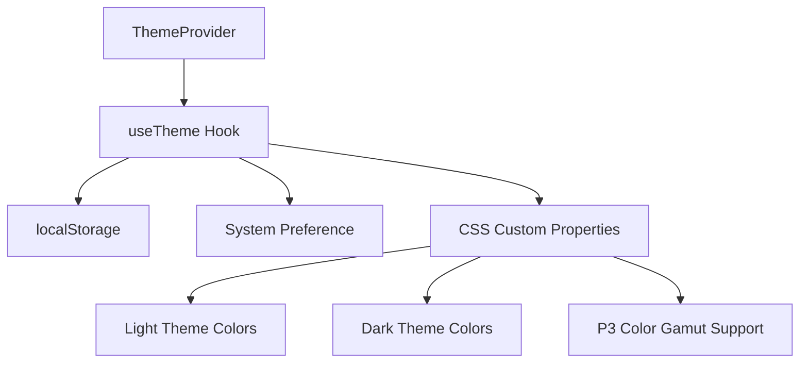
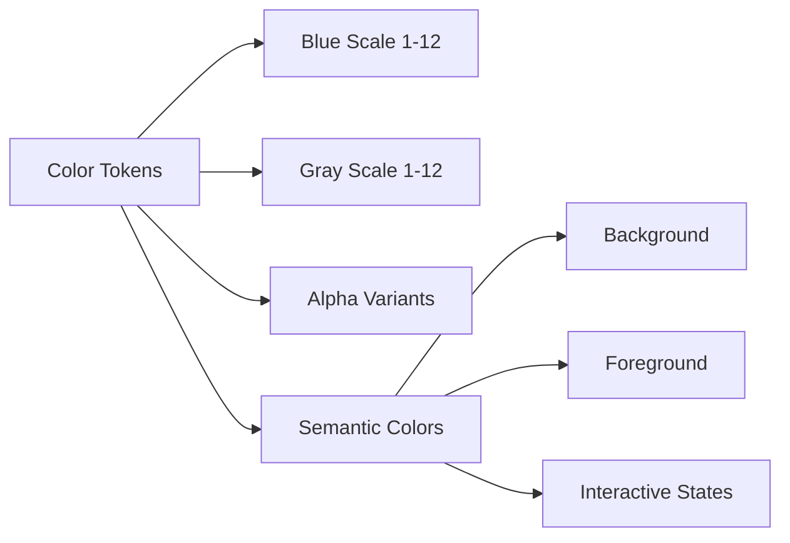

# Styling System Design

## Overview
A comprehensive styling system based on Radix UI color palette with light/dark mode support, gradient backgrounds, and seamless integration with the existing Next.js and Tailwind CSS setup.

## Architecture

### Theme Management System


### Color System Structure


## Components

### ThemeProvider
- **Purpose**: Manages theme state and provides context to the application
- **Props**: `children`, `defaultTheme`, `storageKey`
- **Features**: 
  - Theme persistence in localStorage
  - System preference detection
  - Smooth theme transitions
  - SSR compatibility

### ThemeToggle
- **Purpose**: User interface for switching between light and dark themes
- **Props**: `className`, `size`, `aria-label`
- **Features**:
  - Accessible button with proper ARIA labels
  - Animated icon transitions
  - Visual feedback on interaction
  - Keyboard navigation support

### GradientBackground
- **Purpose**: Provides gradient background styling for pages
- **Props**: `children`, `className`, `variant`
- **Features**:
  - Theme-aware gradient colors
  - Smooth transitions
  - Performance optimized
  - Responsive design

## Data Models

### Theme State
```typescript
type Theme = 'light' | 'dark' | 'system';

interface ThemeContextType {
  theme: Theme;
  setTheme: (theme: Theme) => void;
  resolvedTheme: 'light' | 'dark';
}
```

### Color Tokens
```typescript
interface ColorScale {
  1: string;
  2: string;
  3: string;
  4: string;
  5: string;
  6: string;
  7: string;
  8: string;
  9: string;
  10: string;
  11: string;
  12: string;
  a1: string;
  a2: string;
  a3: string;
  a4: string;
  a5: string;
  a6: string;
  a7: string;
  a8: string;
  a9: string;
  a10: string;
  a11: string;
  a12: string;
  contrast: string;
  surface: string;
  indicator: string;
  track: string;
}
```

## Implementation Strategy

### Phase 1: Core Color System
1. Implement CSS custom properties for light and dark themes
2. Add P3 color gamut support with fallbacks
3. Create TypeScript color token definitions
4. Integrate with Tailwind CSS configuration

### Phase 2: Theme Management
1. Create ThemeProvider component
2. Implement useTheme hook
3. Add localStorage persistence
4. Handle system preference detection

### Phase 3: UI Components
1. Create ThemeToggle component
2. Implement GradientBackground component
3. Update existing components to use new color system
4. Add smooth transitions and animations

### Phase 4: Integration and Testing
1. Update layout to include ThemeProvider
2. Test theme switching functionality
3. Verify color contrast ratios
4. Performance optimization

## Error Handling

### Theme Detection Failures
- Fallback to light theme if system preference detection fails
- Graceful degradation if localStorage is unavailable
- Console warnings for debugging

### Color Gamut Support
- Automatic fallback to sRGB colors if P3 is not supported
- Progressive enhancement approach
- Browser compatibility detection

### Performance Considerations
- CSS custom properties for efficient theme switching
- Minimal JavaScript for theme management
- Optimized gradient rendering
- Reduced layout shifts during theme changes

## Testing Strategy

### Unit Tests
- ThemeProvider state management
- useTheme hook functionality
- Color token accessibility
- Theme persistence logic

### Integration Tests
- Theme switching across components
- Gradient background rendering
- Color system integration
- Performance benchmarks

### Visual Tests
- Theme switching animations
- Color contrast verification
- Gradient appearance across browsers
- Responsive design validation

## Accessibility Considerations

### Color Contrast
- All text meets WCAG AA standards (4.5:1 ratio)
- Interactive elements have sufficient contrast
- Focus indicators are clearly visible
- High contrast mode support

### Keyboard Navigation
- Theme toggle is keyboard accessible
- Proper focus management
- Screen reader compatibility
- ARIA labels and descriptions

### Motion and Animation
- Respects `prefers-reduced-motion`
- Smooth transitions for theme changes
- No flashing or jarring animations
- Performance optimized animations
